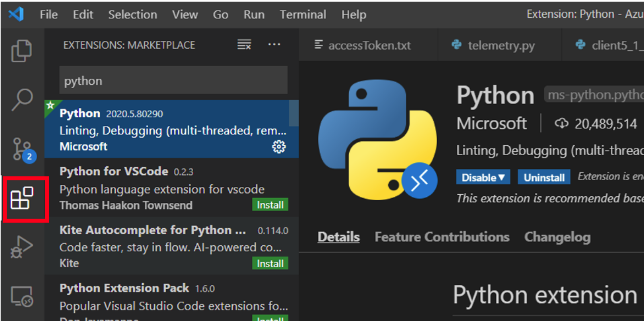
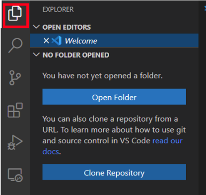

# Python Set Up

In this guide, we will need to run some python scripts in some of the steps.

## Installation

First of all, if we do not have python, we need to install it in our computer. This can be done from the . The installation should also download pip on your computer. 
For Linux computers, python is installed by default. However, pip is not installed by default. You can check if they have been downloaded in your machine by running the following commands in the terminal:
```bash
python3 --version
pip3 --version
```

To install pip in Linux run the following commands: 
```bash
sudo apt-get update 
sudo apt-get -y install python3-pip 
```

If the command above doesn’t work run: 
```bash
curl "https://bootstrap.pypa.io/get-pip.py" -o "get-pip.py" 
python3 get-pip.py --user 
```

After the installation, I recommend using Visual Studio Code as an editor. Download it from the  as well.

## Setting the Environment
1. Open Visual Studio Code, go to the extension tab in the left panel and search python in the search bar. Install the extension. 

    

1. Create a new folder AzureFarmBeats to store all the python scripts. Go to the files tab and click on Open Folder. Open the folder you just created. 

    

1. Open a terminal in Visual Studio Code by clicking terminal at the top and then new terminal. 

    

Now we will create a virtual environment in python to store all the python packages.

### Linux/Mac
1. Run the following command to install python virtual environments:
    ```bash
    python3 -m pip install --user virtualenv 
    ```
2. Create a new virtual environment use the command below:
    ```bash
    python3 -m venv .venv
    ```
    This will create a folder named `.venv` in your current workspace. 

3. Close the terminal and open a new one to activate the environment. Alternatively, you can use the following command to do so:
    ```bash
    python3 -m venv env 
    ```

4. Create a new file named `requirements.txt` with the following content:
    ```
    msal 
    requests 
    azure-eventhub 
    asyncio 
    ```
5. Use the following command to install the libraries in the `requirements.txt` file:
    ```bash
    pip3 install -r requirements.txt
    ```

### Windows
1. Run the following command to install python virtual environments:
    ```bash
    py -m pip install --user virtualenv 
    ```
2. Create a new virtual environment use the command below:
    ```bash
    py -m venv .venv
    ```
    This will create a folder named `.venv` in your current workspace. 

3. Close the terminal and open a new one to activate the environment. Alternatively, you can use the following command to do so:
    ```bash
    .\env\Scripts\activate 
    ```

4. Create a new file named `requirements.txt` with the following content:
    ```
    msal 
    requests 
    azure-eventhub 
    asyncio 
    ```
5. Use the following command to install the libraries in the `requirements.txt` file:
    ```bash
    pip3 install -r requirements.txt
    ```

## Running scripts
To run the python scripts, use the commands below: 

- On macOS and Linux: 
    ```bash
    python nameOfFile.py 
    ```
- On Windows: 
    ```cmd
    py nameOfFile.py 
    ```
    Where nameOfFile is the name of the script you want to run.