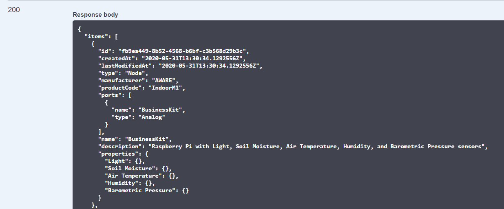
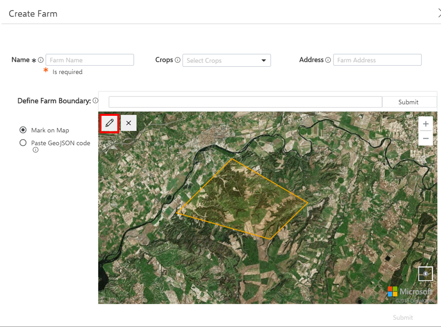
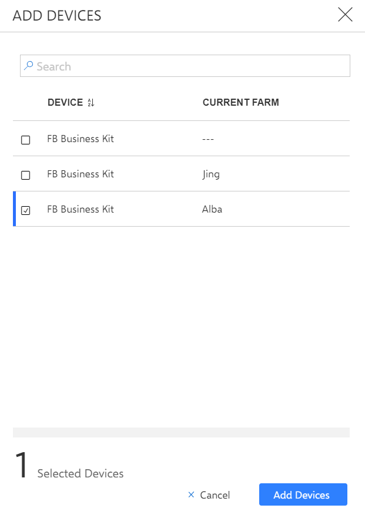

# Create the Business Kit Metadata
Before you can link the FarmBeats Business Kit to Azure FarmBeats you need to create the metadata in your Azure FarmBeatsDatahub in support of the kit.  Metadata you need to create includes DeviceModel, Device, SensorModel, and Sensor.  See Appendix A for metadata details. 

You can use your Swagger API interface to add the necessary data to your FarmBeats deployment in support of the Business kit. 

## Device Model 
First you will create the Device Model.  A Device Model is metadata that describes the Business Kit.   

### Python script
Create a new python file named `deviceModel.py`. Copy the following code to this file.

```python
import os, json, requests, msal 

# Your service principal App ID 
CLIENT_ID = "CLIENT ID" 
# Your service principal password 
CLIENT_SECRET = "CLIENT SECRET" 
# Tenant ID for your Azure subscription 
TENANT_ID = "TENANT ID"
AUTHORITY_HOST = "https://login.microsoftonline.com"
AUTHORITY = AUTHORITY_HOST + '/' + TENANT_ID  

ENDPOINT = "https://farmbeatsimperial-api.azurewebsites.net" 

SCOPE = ENDPOINT + "/.default" 

context = msal.ConfidentialClientApplication(CLIENT_ID, authority=AUTHORITY, client_credential=CLIENT_SECRET) 

token_response = context.acquire_token_for_client(SCOPE) 

# We should get an access token here 
access_token = token_response.get('access_token') 

API_endpoint = "https://<FARMBEATS NAME>-api.azurewebsites.net/DeviceModel" 

headers = { 
  "Accept": "application/json", 
  "Authorization": "Bearer " + access_token, 
  "Content-Type" : "application/json" 
} 

message = { 
  "type": "Node", 
  "manufacturer": "string", 
  "productCode": "string", 
  "ports": [ 
    { 
      "name": "string", 
      "type": "Analog" 
    } 
  ], 
  "name": "string", 
  "description": "string", 
  "properties": { 
    "additionalProp1": {}, 
    "additionalProp2": {}, 
    "additionalProp3": {} 
  } 
} 

message = json.dumps(message) 

response = requests.post(API_endpoint, data=message, headers=headers) 
print(response) 

# To see the response uncomment the next line 
# print(response.text) 
```

### Create Device Model Metadata

1. Edit the message area as follows:
    ```json
    { 
        "type": "Node", 
        "manufacturer": "AWARE", 
        "productCode": "IndoorM1", 
        "ports": [ 
            { 
                "name": "BusinessKit", 
                "type": "Analog" 
            } 
        ], 
        "name": "BusinessKit", 
        "description": "Raspberry Pi with Light, Soil Moisture, Air Temperature, Humidity, and Barometric Pressure sensors", 
        "properties": { 
            "Light": {}, 
            "Soil Moisture": {}, 
            "Air Temperature": {}, 
            "Humidity": {}, 
            "Barometric Pressure": {} 
        } 
    } 
    ```

1. Run the script by using the following commands:
    - For Linux/Mac:
    ```bash
    python3 deviceModel.py
    ```
    - For Windows:
    ```cmd
    py deviceModel.py
    ```

1. If the message was successfully posted, the terminal will return a 200 response. 

    

1. Go to the DataHub > deviceModel > Get, to confirm that your Business Kit Device Model has been added. 

    i. Click the Get heading, and then Try it out.
        

    ii. Scroll down and click Execute.  
        

    iii. The Response Body should show your newly created Device Model. 
        

    iv. Make a note of the **Device Model ID#**.  You will use it when you create your Device.  

## Device
Next, use the Swagger API interface to add your Device.  The Device represents the physical hardware you plan to attach your sensors to.  For this step you will need a few pieces of information: The **Device Model ID#** from the previous step, and the **MAC address** for your raspberry pi. 

### Python Script
Create a new python file named `device.py`. Copy the following code to this file.

```python
import os, json, requests, msal 

# Your service principal App ID 
CLIENT_ID = "CLIENT ID" 
# Your service principal password 
CLIENT_SECRET = "CLIENT SECRET" 
# Tenant ID for your Azure subscription 
TENANT_ID = "TENANT ID"
AUTHORITY_HOST = "https://login.microsoftonline.com"
AUTHORITY = AUTHORITY_HOST + '/' + TENANT_ID  

ENDPOINT = "https://farmbeatsimperial-api.azurewebsites.net" 

SCOPE = ENDPOINT + "/.default" 

context = msal.ConfidentialClientApplication(CLIENT_ID, authority=AUTHORITY, client_credential=CLIENT_SECRET) 

token_response = context.acquire_token_for_client(SCOPE) 

# We should get an access token here 
access_token = token_response.get('access_token') 

API_endpoint = "https://<FARMBEATS NAME>-api.azurewebsites.net/Device" 

headers = { 
  "Accept": "application/json", 
  "Authorization": "Bearer " + access_token, 
  "Content-Type" : "application/json" 
} 

message = { 
  "deviceModelId": "string", 
  "hardwareId": "string", 
  "farmId": "string", 
  "reportingInterval": 0, 
  "location": { 
    "latitude": 0, 
    "longitude": 0, 
    "elevation": 0 
  }, 
  "parentDeviceId": "string", 
  "name": "string", 
  "description": "string", 
  "properties": { 
    "additionalProp1": {}, 
    "additionalProp2": {}, 
    "additionalProp3": {} 
  } 
} 

message = json.dumps(message) 

response = requests.post(API_endpoint, data=message, headers=headers) 
print(response) 

# To see the response uncomment the next line 
# print(response.text) 
```
### Create Device Metadata

1. Edit the message area as follows:
    ```json
    { 
    "deviceModelId": "<the Device Model ID# you created>", 
    "hardwareId": "<MAC address for your raspberry pi>",
    "reportingInterval": 300, 
    "location": { 
        "latitude": 0, 
        "longitude": 0, 
        "elevation": 0 
    }, 
    "name": "FB Business Kit", 
    "description": "FB Business Kit", 
    } 
    ```

1. Run the script by using the following commands:
    - For Linux/Mac:
    ```bash
    python3 device.py
    ```
    - For Windows:
    ```cmd
    py device.py
    ```

1. If the message was successfully posted, the terminal will return a 200 response. 

    

1. Go to the DataHub > Device > Get, to confirm that your Business Kit Device has been added. 

    *Make a note of the **Device ID**.  You will use it when you create your Sensors.*


## Sensor Model 

Now that you have a Device Model and Device created to represent your FarmBeats Business Kit, you will create the Sensor Model and Sensor metadata.  Let’s start with the Sensor Model data.   

### Python Script
Create a new python file named `sensorModel.py`. Copy the following code to this file.

```python
import os, json, requests, msal 

# Your service principal App ID 
CLIENT_ID = "CLIENT ID" 
# Your service principal password 
CLIENT_SECRET = "CLIENT SECRET" 
# Tenant ID for your Azure subscription 
TENANT_ID = "TENANT ID"
AUTHORITY_HOST = "https://login.microsoftonline.com"
AUTHORITY = AUTHORITY_HOST + '/' + TENANT_ID  

ENDPOINT = "https://farmbeatsimperial-api.azurewebsites.net" 

SCOPE = ENDPOINT + "/.default" 

context = msal.ConfidentialClientApplication(CLIENT_ID, authority=AUTHORITY, client_credential=CLIENT_SECRET) 

token_response = context.acquire_token_for_client(SCOPE) 

# We should get an access token here 
access_token = token_response.get('access_token') 

API_endpoint = "https://<FARMBEATS NAME>-api.azurewebsites.net/SensorModel" 

headers = { 
  "Accept": "application/json", 
  "Authorization": "Bearer " + access_token, 
  "Content-Type" : "application/json" 
} 

message = { 
  "type": "Analog", 
  "manufacturer": "string", 
  "productCode": "string", 
  "sensorMeasures": [ 
    { 
      "name": "string", 
      "dataType": "Double", 
      "type": "string", 
      "unit": "string", 
      "aggregationType": "None", 
      "depth": 0, 
      "description": "string" 
    } 
  ], 
  "name": "string", 
  "description": "string", 
  "properties": { 
    "additionalProp1": {}, 
    "additionalProp2": {}, 
    "additionalProp3": {} 
  } 
} 

message = json.dumps(message) 

response = requests.post(API_endpoint, data=message, headers=headers) 
print(response) 

# To see the response uncomment the next line 
# print(response.text) 
```

### Create Sensor Model Metadata
#### BME280 sensor
1. Edit the message area as follows:
    ```json
    { 
        "type": "Analog", 
        "manufacturer": "Grove", 
        "productCode": "BME280", 
        "sensorMeasures": [ 
            { 
                "name": "grove_temperature", 
                "dataType": "Double", 
                "type": "AmbientTemperature", 
                "unit": "Farenheit", 
                "aggregationType": "None", 
                "depth": 0, 
                "description": "grove temperature" 
            },  
            { 
                "name": "grove_humidity", 
                "dataType": "Double", 
                "type": "RelativeHumidity", 
                "unit": "Percentage", 
                "aggregationType": "Average", 
                "depth": 0, 
                "description": "grove relative humidity" 
            },
            { 
                "name": "grove_barometer", 
                "dataType": "Double", 
                "type": "Pressure", 
                "unit": "Percentage", 
                "aggregationType": "Average", 
                "depth": 0, 
                "description": "grove barometric pressure" 
            } 
        ], 
        "name": "BME280", 
        "description": "Grove - Temp&Humi&Barometer Sensor"
    } 
    ```

1. Run the script by using the following commands:
    - For Linux/Mac:
    ```bash
    python3 sensorModel.py
    ```
    - For Windows:
    ```cmd
    py sensorModel.py
    ```

1. If the message was successfully posted, the terminal will return a 200 response. 

    

1. Go to the DataHub > SensorModel > Get, to confirm that your BME280 sensor model has been added. 

    *Make a note of the **Sensor Model ID**.  You will use it when you create your BME280 sensor.*

#### Soil Moisture
1. Edit the message area as follows:
    ```json
    {
        "type": "Analog", 
        "manufacturer": "Grove", 
        "productCode": "V1.2", 
        "sensorMeasures": [ 
            { 
                "name": "capacitive_soil_moisture", 
                "dataType": "Double", 
                "type": "SoilMoisture", 
                "unit": "Percentage", 
                "aggregationType": "Average", 
                "depth": 0, 
                "description": "grove capacitive soil moisture" 
            } 
        ], 
        "name": "grove soil moisture", 
        "description": "Grove capacitive soil moisture" 
    }
    ```

1. Run the script by using the following commands:
    - For Linux/Mac:
    ```bash
    python3 sensorModel.py
    ```
    - For Windows:
    ```cmd
    py sensorModel.py
    ```

1. If the message was successfully posted, the terminal will return a 200 response. 

    

1. Go to the DataHub > SensorModel > Get, to confirm that your soil moisture sensor model has been added. 

    *Make a note of the **Sensor Model ID**.  You will use it when you create your sensor.*

#### Light Sensor
1. Edit the message area as follows:
    ```json
    { 
        "type": "Analog", 
        "manufacturer": "Grove", 
        "productCode": "LS06-S phototransistor", 
        "sensorMeasures": [ 
            { 
                "name": "grove_light_sensor", 
                "dataType": "Double", 
                "type": "SolarRadiation", 
                "unit": "Percentage", 
                "aggregationType": "Average", 
                "depth": 0, 
                "description": "Grove - Light Sensor v1.2" 
            } 
        ], 
        "name": "grove solar radiation", 
        "description": "Grove - Light Sensor v1.2" 
    }
    ```

1. Run the script by using the following commands:
    - For Linux/Mac:
    ```bash
    python3 sensorModel.py
    ```
    - For Windows:
    ```cmd
    py sensorModel.py
    ```

1. If the message was successfully posted, the terminal will return a 200 response. 

    

1. Go to the DataHub > SensorModel > Get, to confirm that your light sensor model has been added. 

    *Make a note of the **Sensor Model ID**.  You will use it when you create your sensor.*

## Sensor
Now create entries for the physical sensors you have attached to your FarmBeats Business Kit.  For this step you will need the **Sensor Model ID#s** created in the previous section, and the **Device ID#** for the Business Kit you created.   

### Python Script
Create a new python file named `sensor.py`. Copy the following code to this file.

```python
import os, json, requests, msal 

# Your service principal App ID 
CLIENT_ID = "CLIENT ID" 
# Your service principal password 
CLIENT_SECRET = "CLIENT SECRET" 
# Tenant ID for your Azure subscription 
TENANT_ID = "TENANT ID"
AUTHORITY_HOST = "https://login.microsoftonline.com"
AUTHORITY = AUTHORITY_HOST + '/' + TENANT_ID  

ENDPOINT = "https://farmbeatsimperial-api.azurewebsites.net" 

SCOPE = ENDPOINT + "/.default" 

context = msal.ConfidentialClientApplication(CLIENT_ID, authority=AUTHORITY, client_credential=CLIENT_SECRET) 

token_response = context.acquire_token_for_client(SCOPE) 

# We should get an access token here 
access_token = token_response.get('access_token') 

API_endpoint = "https://<FARMBEATS NAME>-api.azurewebsites.net/SensorModel" 

headers = { 
  "Accept": "application/json", 
  "Authorization": "Bearer " + access_token, 
  "Content-Type" : "application/json" 
} 

message = { 
  "hardwareId": "string",
  "sensorModelId": "string",
  "location": { 
    "latitude": 0, 
    "longitude": 0, 
    "elevation": 0 
  }, 
  "depth": 0, 
  "port": { 
    "name": "string", 
    "type": "Analog" 
  }, 
  "deviceId": "string", 
  "name": "string", 
  "description": "string", 
  "properties": { 
    "additionalProp1": {}, 
    "additionalProp2": {}, 
    "additionalProp3": {} 
  } 
} 

message = json.dumps(message) 

response = requests.post(API_endpoint, data=message, headers=headers) 
print(response) 

# To see the response uncomment the next line 
# print(response.text) 
```

### Create Sensor Model Metadata
#### BME280 sensor
1. Edit the message area as follows:
    ```json
    { 
        "hardwareId": "BME280", 
        "sensorModelId": "< sensor model id# from the previous section for BME280>", 
        "location": { 
            "latitude": 0, 
            "longitude": 0, 
            "elevation": 0 
        }, 
        "depth": 0, 
        "port": { 
            "name": "BusinessKit", 
            "type": "Analog" 
        }, 
        "deviceId": "< device id# of the device you created >", 
        "name": "pressure", 
        "description": "Grove - Temp & Hum & Bar sensors", 
        "properties": { 
            "Pressure": {}, 
            "Humidity": {}, 
            "Temperature": {} 
        } 
    }  
    ```

1. Run the script by using the following commands:
    - For Linux/Mac:
    ```bash
    python3 sensor.py
    ```
    - For Windows:
    ```cmd
    py sensor.py
    ```

1. If the message was successfully posted, the terminal will return a 200 response. 

    

1. Go to the DataHub > Sensor > Get, to confirm that your BME280 sensor has been added. 


#### Soil Moisture
1. Edit the message area as follows:
    ```json
    {
        "hardwareId": "V1.2", 
        "sensorModelId": "< sensor model id# from the previous section for MOISTURE >", 
        "location": { 
            "latitude": 0, 
            "longitude": 0, 
            "elevation": 0 
        }, 
        "depth": 0, 
        "port": { 
            "name": "BusinessKit", 
            "type": "Analog" 
        }, 
        "deviceId": "< device id# of the device you created >", 
        "name": "soil moisture", 
        "description": "soil moisture" 
    } 
    ```

1. Run the script by using the following commands:
    - For Linux/Mac:
    ```bash
    python3 sensor.py
    ```
    - For Windows:
    ```cmd
    py sensor.py
    ```

1. If the message was successfully posted, the terminal will return a 200 response. 

    

1. Go to the DataHub > Sensor > Get, to confirm that your soil moisture sensor has been added. 

#### Light Sensor
1. Edit the message area as follows:
    ```json
    { 
        "hardwareId": "LS06-S", 
        "sensorModelId": "< sensor model id# from the previous section for LIGHT >", 
        "location": { 
            "latitude": 0, 
            "longitude": 0, 
            "elevation": 0 
        }, 
        "depth": 0, 
        "port": { 
            "name": "BusinessKit", 
            "type": "Analog" 
        }, 
        "deviceId": "< device id# of the device you created >", 
        "name": "solar radiation", 
        "description": "solar radiation" 
    } 
    ```

1. Run the script by using the following commands:
    - For Linux/Mac:
    ```bash
    python3 sensor.py
    ```
    - For Windows:
    ```cmd
    py sensor.py
    ```

1. If the message was successfully posted, the terminal will return a 200 response. 

    

1. Go to the DataHub > Sensor > Get, to confirm that your light sensor has been added. 

## Accelerator
Once you have finished creating the FarmBeats Business Kit metadata you should see the Business Kit device, and the sensors connected to it in your FarmBeats deployment.  Open a browser and navigate to your FarmBeats site.   

When you click on **Devices** you should see the Business Kit device in an *Offline* state. 

When you click **Sensors** you should see the three sensors you created. 

Remember this is only a placeholder for the FarmBeats Business Kit and its sensors.  There is not yet a connection to the actual Business Kit and there is none of the Business Kit sensor data in Azure FarmBeats. 

## Connect your Device to your Farm
After creating the all the metadata, we need to assign our device to a farm.

### Creating the Farm
1. Go to the accelerator website.

1. Click on `+ Create Farm`.

    

1. Fill in the details of the Farm. Only **Name** and **Farm Boundaries** are required. For the farm boundaries, you can do this by selecting **Mark on map**, and then use the pen located at the top left corner of the map.

    

1. Finally, clink on the Submit button located at the bottom right corner.

### Asign you device to the Farm
1. Click on the farm you have just created.

1. Select `Add devices`.

    

1. Select your device and click on **Add Devices**.

    
    
-------
Go to next step: [Send Historical Data](./Send_historical_data.md)