# Send Historical Data From IoT Central to Azure FarmBeats

After registering the [aware kit](https://farmbeatsstudentkit.com/Student), it will automatically create an IoT application at IoT Central. You can also create your own IoT application using Azure Services. This data can be exported and sent to Azure FarmBeats:

1. Go to the portal and create a new event hubs. You can simply look for it in the search bar.
Click on the one under MarketPlace.
    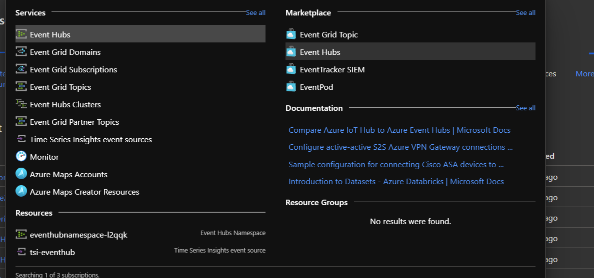

1. This will bring you to this window.
    * Subscription: Select your own subscription.
    * Resource group: Select the resource group created during deployment of the FarmBeats.
    * Name Space: choose a name such as Aware Data or IoT Data.
    * Location: chose your own location.
    * Pricing Tier: chose basic.

    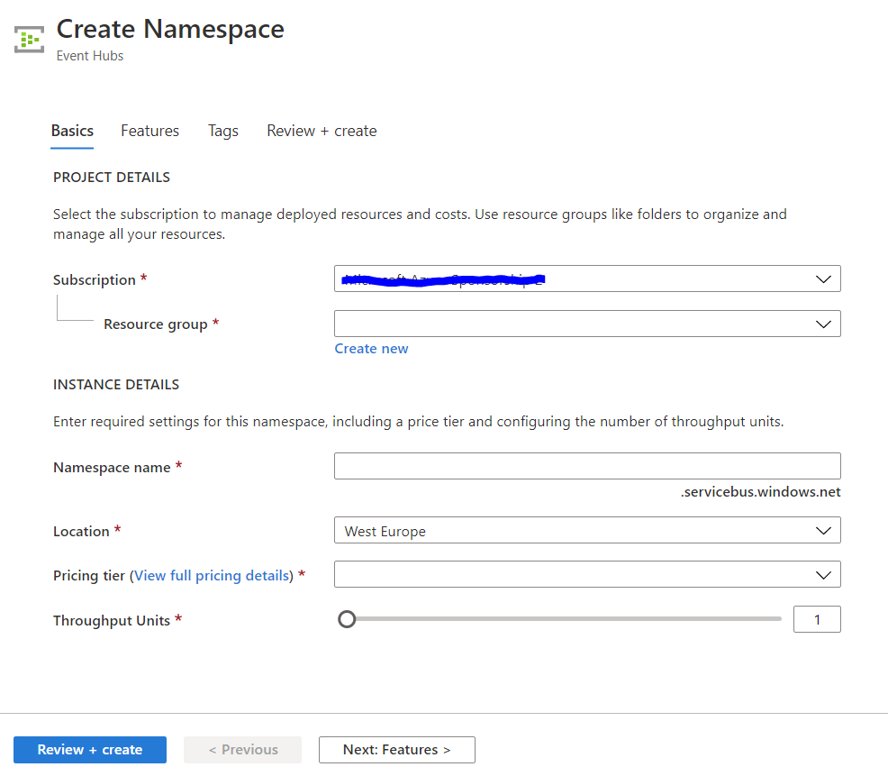

1. Click on `Review + Create`, and then `Create`.

    

1. Choose a name and change the Message Retention to 7. Then just click on the create button and the bottom.

    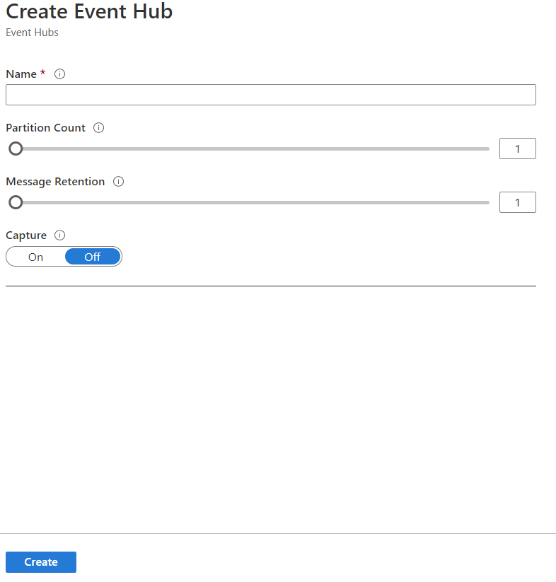

1. In the event hubs, go to **Shared access policies**. Select `RootManageSharedAccessKey`, and copy the **Connection string-primary key**. You will need it later on.

    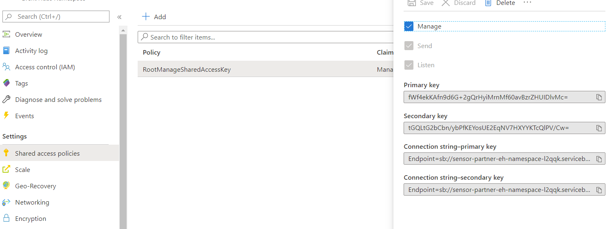

1. Go to the IoT Central application. And click on Data Export on the left panel.

    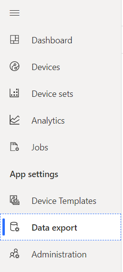

1. Click on `+ New` to create a new one, and then choose `Azure Event Hubs`.

    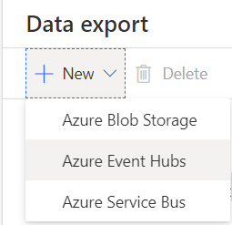

1. Enter the Connection String and select the Event Hub you just created. Export only the measurements and save it. Now your Event Hub should be receiving the data from IoT Central.

    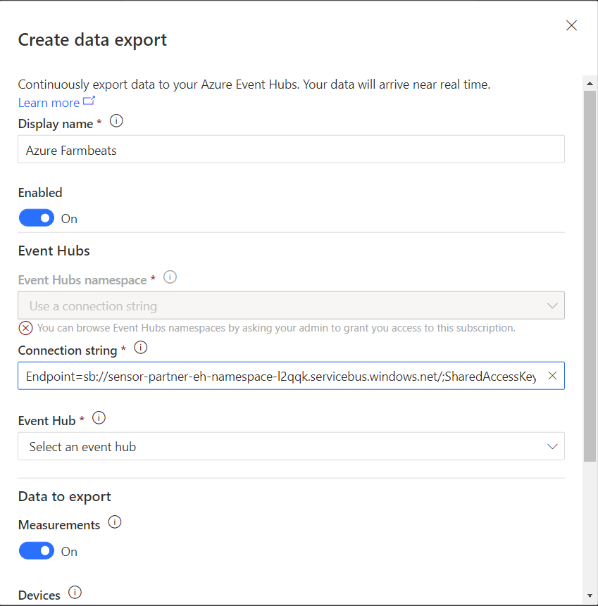

    You can check this by going into your event hub and see incoming messages in the overview tab.

1. As we mentioned earlier, for the data to be displayed in the accelerator, the message sent to the even hub needs to be in a specific format. In this case we will use Azure Stream Analytics to do this.

1. Search Stream Analytics Jobs in the search bar and click on the one below MarketPlace label.

    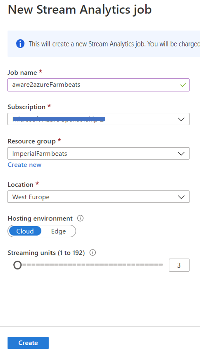

    Once you have filled the form, click on create.

1. Then wait for the deployment. When it is finished, click on go to resource.
    Go to `inputs` > `+ Add stream input` > `Azure event hubs`.

    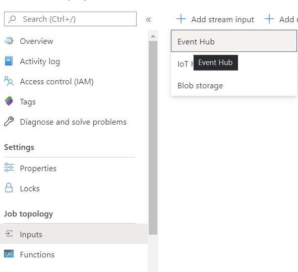

1. Fill in the details.
    * Input alias: name displayed in Stream Analytics. Chose whatever you want. I called it `awaretelemetry`.
    * Subscription: chose your subscription.
    * Event Hub namespace: chose the one we just created.
    * Event hub name: use existing and chose the one we created.
    * Event hub policy name: use existing. (there should only be one).
    * Consumer group: create a new one.
    * Leave the rest as it is.

    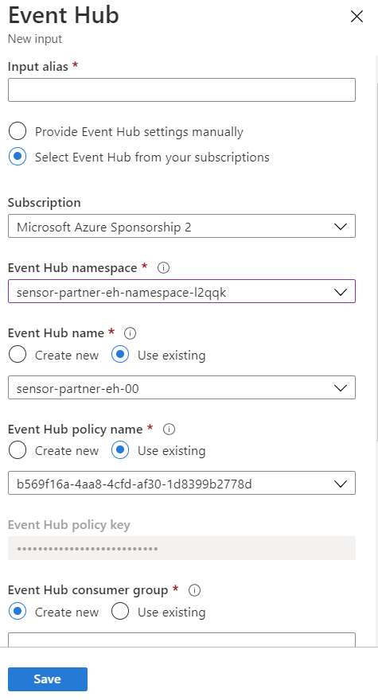

1. You should see something like this after saving the changes.

    

1. Inside stream analytics, go to **outputs**. Add an Event Hubs.

    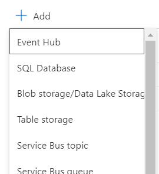

1. This is similar to the step above. But in this case chose the **sensor-partner-eh-namespace-l2qqk** as the Event hub namespace. And let the Event hub name be the same as the entity path obtained inside the Event Hub connection string when creating the partner credentials.

1. Go to Query inside stream analytics. **These 2 steps may change if you are not using the IoT central given after [registering your device](https://farmbeatsstudentkit.com/Student)**. Change the query as follows.

    ```sql
    SELECT
    '<DEVICE ID>' AS deviceid,
    awarettelemetry.EventProcessedUtcTime AS timestamp,
    '1' AS version,
    udf.processArray(awaretelemetry) as sensors
    INTO sensor00
    FROM awarettelemetry
    ```

    This will create the general format required by the accelerator. Replace \<DEVICE ID> with your **device id**, replace **sensor00** with your output stream, and **awaretelemetry** with your input stream.

1. We will use a function to create the sensors array required by the accelerator. Your can check all the names of the input by going back to the query and looking at input preview.

    

1. Go to functions inside stream analytics and create a new one. In function alias write processArray. Leave the output type as any.
    Then replace the function with:

    ```cpp
    function main(data) {
        var sensors = [];
        sensors =[
            {
                "id": "<SENSOR ID FOR SOIL MOISTURE>",
                "sensordata": [
                {
                    "timestamp": data.EventProcessedUtcTime,
                    "capacitive_soil_moisture": data.SoilMoisture1,
                }
                ]
            },
            {
                "id": "<SENSOR ID FOR LIGHT SENSOR>",
                "sensordata": [
                {
                    "timestamp": data.EventProcessedUtcTime,
                    "grove_light_sensor": data.Light
                }
                ]
            },
            {
                "id": "<SENSOR ID FOR BME280>",
                "sensordata": [
                {
                    "timestamp": data.EventProcessedUtcTime,
                    "grove_temperature": data.AirTemperatureF,
                },
                {
                    "timestamp": data.EventProcessedUtcTime,
                    "grove_humidity": data.AirHumidity,
                },
                {
                    "timestamp": data.EventProcessedUtcTime,
                    "grove_barometer": data.AirPressure
                }
                ]
            }]
        return sensors;
    }
    ```

    For example data.SoilMoisture1 will access the column SoilMoisture1 from the input. When you are done, save the function.

1. Go back to queries and test the query. In test results you should get something like this:

    

1. Go back to the overview tab inside Stream analytics. It may take a few minutes for the job to start running. After this, your accelerator should be receiving and displaying all the data from IoT Central.

    

