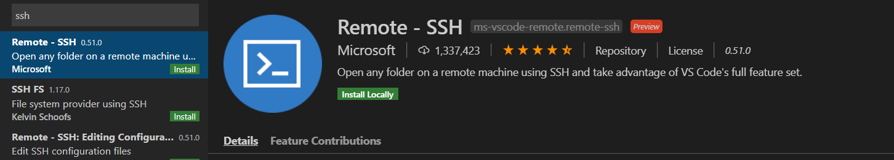

# Send Telemetry Data to IoT Central from Raspberry Pi

In this tutorial, we will work through the python code used to send data from our Raspberry Pi to IoT Central.

If you don't have python installed, please refer to the [Basic Python](../Azure_FarmBeats_Integration/Basic_python.md) tutorial in Azure FarmBeats integration.

## Connect to the Raspberry Pi from Visual Studio Code

To write the code for the Raspberry Pi, you will use the Remote development capabilities of Visual Studio Code.

### Install the Remote Development extention in Visual Studio Code

To enable remote development in Visual Studio Code, you will need to install the **Remote development extension**.

1. Launch Visual Studio Code.

1. Select the Extensions tab from the left hand menu, or select *View > Extensions*.

1. Search for ssh and install `Remote - ssh`. Click on `install` or `install locally`.

    
