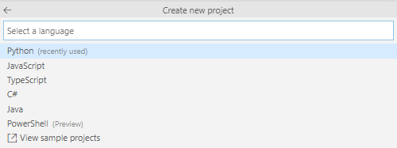
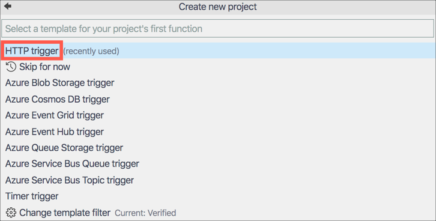
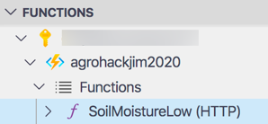

# Create an Azure Function Application

This lab will teach you how to use an Azure function application to process the sensor data collected from your device. This includes setting up a real-time data pipeline with Stream Analytics as done previously for [steaming sensor data into blob storage](../../Lab1_MonitorYourPlant/IoTCentral/Create_stream_analytics.md).

## Azure Functions

Azure Functions is an event driven serverless compute platform, essentially a way to define small blocks of code that are triggered by events such as a web request, data changes in storage or events being put onto an Azure Event Hub. They can be written in a multitude of different languages including C#, F#, Java, JavaScript and Python.

Azure Stream Analytics can call Azure Functions in response to streaming data, either individual messages or an aggregation across a time window.
 
For this lab, the moisture measurement needs to be checked against a defined level, and if it is too low then the plant needs watering. Events are coming in every 60 seconds, and the moisture level doesn't need to be checked that often, instead an average over 5 minutes can be checked.

The Azure Function to be created will be triggered by a web request, called from Azure Stream Analytics.

### Configure Visual Studio Code for Azure Functions development

To build, test and deploy Azure Functions in Python using Visual Studio Code, you will need to install the `Azure Functions` extension.

1. Launch Visual Studio Code. You will be developing locally, so close any remote development sessions to the Raspberry Pi that you have open.

1. Select the Extensions tab from the left hand menu, or select *View -> Extensions*

   

1. Search for `Azure Functions` and install the *Azure Functions* extension from Microsoft by selecting **Install**.

   

### Create a new Azure Functions project

1. Create a new folder for the Azure Functions project called `MoistureTrigger`

1. Launch Visual Studio Code and open the new folder using either the **Open Folder** button in the Explorer, or by selecting *File -> Open..*

1. From Visual Studio Code, launch the command palette

   * On macOS, press command+shift+p
   * On Windows or Linux, press ctrl+shift+p

1. Search for `Azure Functions: Create New Project` and select it

   

1. Select the folder to create the project in. The currently open folder will be one of the options, so select it.

   

1. Select **Python** for the function project language

   

1. The function will be created using a Python Virtual environment, so select the Python version to use. Select the latest version of Python 3 that you have installed.

   

1. The function project will be created with a single trigger. Select the *Http Trigger* option to have this function triggered by a web request.

   

1. Name the function `SoilMoistureLow`

   

1. Set the function authorization level to `Function`. This means it can only be called using a key either as a header or a query string. Without the key the function cannot be called.

   

The project and virtual environment will be created. This will take a few seconds.

### Write the code for the function

In this step, the function just needs to exist so that it can be called by Azure Stream Analytics, along with some logging. In a later step more code will be added to it to check weather and execute an Azure IoT Central command.

1. Open the `__init__.py` file from the `SoilMoistureLow` folder if it's not already open

1. Change the `main` function to the following:

    ```python
    def main(req: func.HttpRequest) -> func.HttpResponse:
        # Log the function was called
        logging.info('Python HTTP trigger function processed a request.')

        # Return a 200 status
        return func.HttpResponse(f"OK")
    ```

1. Save the file

### Test the function


1. Select the debugger from the left-hand menu, or select `View -> Debug`

   

1. Select the **Start Debugging** button from the top of the debug pane. It is a green play triangle ▶️.

   

1. The Azure Functions runtime will launch and host the function. When it is running you will see the list of functions inside the app in the terminal containing the single Http trigger.

   

1. Test the trigger by opening [http://localhost:7071/api/SoilMoistureLow](http://localhost:7071/api/SoilMoistureCheck) in your web browser. In the terminal in Visual Studio Code you will see the call being made, and the browser will show the output of `OK`.

   

1. When you have finished testing the function, detach from the functions host debugger by selecting the **Disconnect** button from the debug toolbar

   


## Deploy the function to Azure

Azure Stream Analytics needs to be able to access the URL for the function to be able to run it. This means it cannot call functions running locally, so the function will need to be published to Azure to make it publicly available and therefore callable from Azure Stream Analytics.

1. From Visual Studio Code, launch the command palette

   * On macOS, press command+shift+p
   * On Windows or Linux, press ctrl+shift+p

1. Search for `Azure Functions: Deploy to Function App` and select it

   

1. If you have multiple Azure subscriptions a list of them will be shown, so select the correct one

1. Select `+ Create new Function App in Azure... (Advanced)`. There are two options with this name, one marked as `Advanced`. Select the one that is marked as `Advanced`. The Advanced option gives more control including adding the Function App to the existing Resource Group.

   

1. Give the Function App a name that is globally unique, so include things such as the date or your name, for example `luludevice2020`. To make it easier, name it the same as your Azure IoT Central app and storage account.

   

1. Select `Linux` for the OS

   

1. Select `Consumption` for the app service plan. This plan means you only pay based off the function app usage, with a generous free tier.

   

1. Select the latest Python 3 runtime that is available

   

1. Select the `AgroHack` Resource Group

   

1. Select the storage account that was created earlier for the data export. This storage account is used to save the files needed for the function app.

   

1. Select *Create new Application Insights Resource*. Application Insights allows you to monitor the Function App.

   

1. Accept the default Application Insights name

1. The Function App will be created and your code deployed. This will take a few seconds and a notification will pop up when complete.

1. Select the Azure tab from the left-hand menu

   

1. In the *Functions* section, expand your subscription to see all your Function Apps. Expand the newly created function app to see all functions.

   

1. Right-click on the *SoilMoistureCheck (HTTP)* function and select *Copy Function Url*

1. Paste this URL into a browser and test the function is working


-------------------

Next Step:  [Create a Stream Analytics Job](Create_stream_analytics.md)