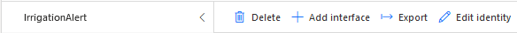
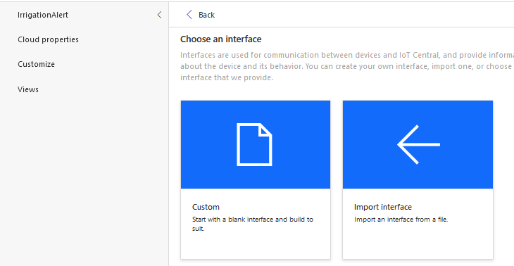

# Creating a new device template for IoT Central

You have already created an IoT Central Application in Lab 1. For this scenario, you will need to add a new Interface so that a command to trigger the alert system can be sent to the device.

## Sorry will commit the rest of the changes just a second :S 

## Create Device Template

As seen in Lab 1, device types are defined using templates - these specify the capabilities of the device including the telemetry that can be received from the device, and commands that can be sent to it.

We have already created a device template that receives temperature, humidity, air pressure, soil moisture and light conditions from your sensor device. You will need to define a new template that has these values on it, as well as a new command that communicates to the raspberry pi when the plant needs to be watered.

1. From the left panel select **Device Template**. Then click on **+ New**.

   

1. Select the **IoT Device** template.

   

1. Select the **Next: Customize** button.

1. Select the **Next: Review** button.

1. Select the **Create** button.

1. Name the template `SensorMonitor`.

Once the template is created, you need to add capabilities to it as you have done previously. These are defined using **capability models**, which define the capabilities of all devices that will use this template. 

1. Select the **Custom** capability model

## Add an interface

1. Add a new interface to the capability model by selecting the top level *Environment sensor* item in the menu and selecting **+Add interface**

   

1. Select **Custom**

   

This interface needs 5 telemetry values added to it for the temperature, pressure, humidity, soil moisture and light level. Telemetry values have the following properties:

* **Display name** - this defines what is shown on a view to display the value
* **Name** - this maps to the values being sent from the device
* **Capability type** - this defines what type of value this is, and includes some standard types such as temperature or pressure.
* **Schema** - this defines the data type for the value being received, such as an integer or a floating point number
* **Unit** - this defines the unit for know telemetry types, for example °C for temperatures.

1. Select the **+ Add capability** button to add new capabilities, and add the following four values:

   |  Display Name     | Name          | Capability Type | Semantic Type | Schema | Unit |
   | -------------     | ------------- | --------------- | ------------- | ------ | ---- |
   | Temperature       | temperature   | Telemetry       | Temperature   | Double | °C   |
   | Pressure          | pressure      | Telemetry       | Pressure      | Double | kPa  |
   | Humidity (%)      | humidity      | Telemetry       | Humidity      | Double | %    |
   | Soil Moisture (%) | soil_moisture | Telemetry       | None          | Double | % |
   | Light Level (%)   | light_level   | Telemetry       | None          | Double | % |
   | Needs Watering   | needs_watering   | Command       

   

## Add a view

1. Select **Views** from the menu.

   

1. Select Visualizing the device

   

1. Set the view name to `Overview`. We will use this view to show the charts of the values recorded.

1. Drag *Temperature* from the *Telemetry* section onto the dashboard. This will add a graph showing the temperature recorded over the past 30 minutes to the dashboard. You can configure this in multiple ways using the control buttons on the top of the panel:

    Change the visualization to be a number of different chart types, or the last known value

    Change the size of the panel on the dashboard

    Configure the chart including legend, axis labels and the time range

   Configure the chart or last know value to your liking.

1. Repeat this for the other telemetry values. If you want to plot multiple telemetry values on the same chart use the check boxes to select multiple values and drag them together. You can add telemetry values multiple times to get multiple views over the data.

1. You can also customize the view with labels, markdown or images if desired.

1. Select the **Save** button from the top menu

   

1. You can create another view showing just the last value received if you want.

   Here is an example of how it can look like.

   

   

## Publish the device template

Before the device template can be assigned to a device, it needs to be published. Once published, any intefaces defined on it cannot be changed, instead a new version of the device template needs to be created.

1. Select the **Publish** button from the top-most menu.

   

1. Click on Publish.

   

## Create a device

1. Go to **Devices** > **SensorMonitor**.

   

1. Select **+ New**.

1. Set the **Device Name** to `Raspberry pi` and the **Devide Id** to `raspberry_pi`. Then Click on **Create**.

   

A new device should appear in the devices list.

### Get the device connection details

Each device has a seet of connection details that will be used on the actual device to connect to Azure IoT Central and send telemetry.

1. Click on the Raspberry pi device you have just created.

1. Click on the `Connect` button located at the top right corner.

   

1. Take note of the **ID Scope**, **Device Id** and **Primary key**. You will need these values to send the data from the raspberry pi.

   

------------------

[Next Step](./Send_data_to_IoTCentral.md): write the python code to send telemetry data to IoT Central.
