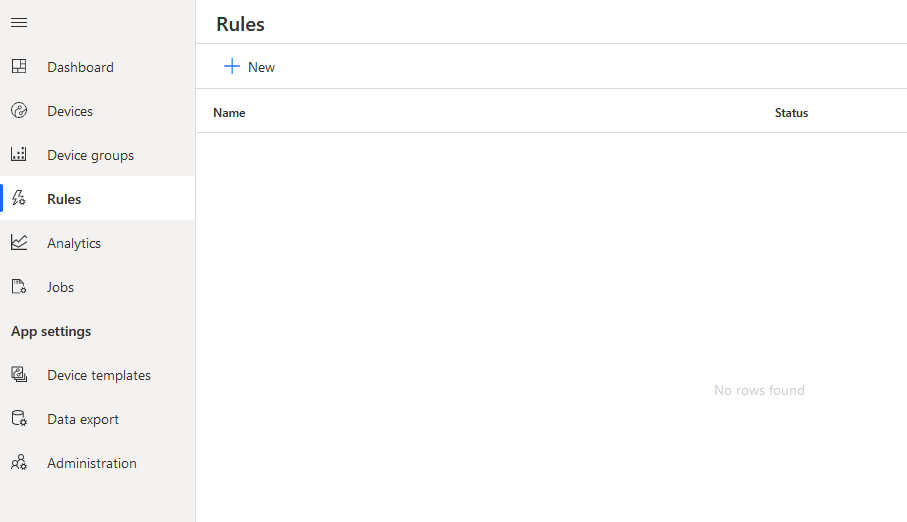
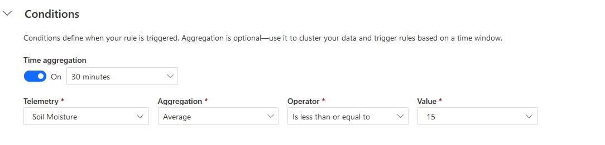
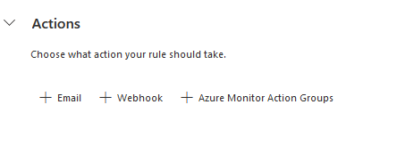
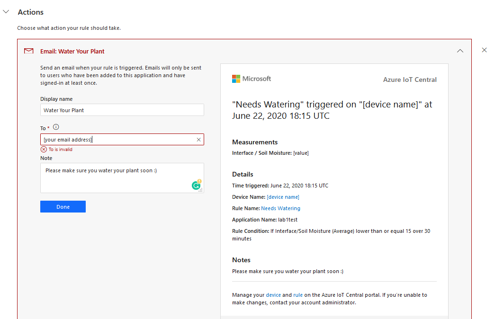

## Create a rule in IoT Central

This lab goes through the steps of setting up a rule in IoT Central Application. 

Get notified when soil moisture below a certain level (or when command is triggered)

1. Click on **Rules**

    

1. Set conditions that trigger the notification.

    

    You can choose from sum, average, minimum, maximum .....

1. Choose what happens when the conditions are met

    

    

Note: we could try to look at this webhooks option and see if there is anything interesting we could do with it. Otherwise just explain? Or ignore.