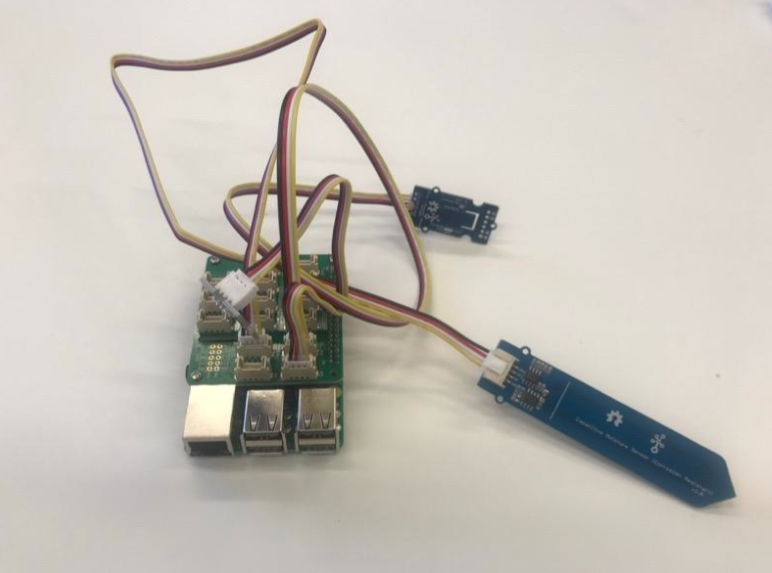
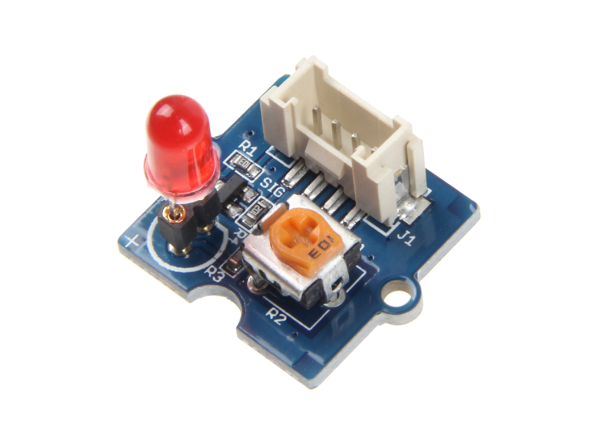
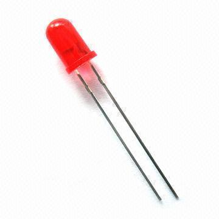
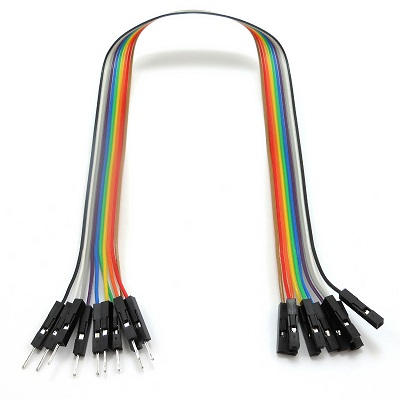
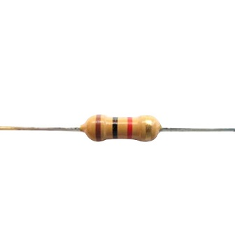
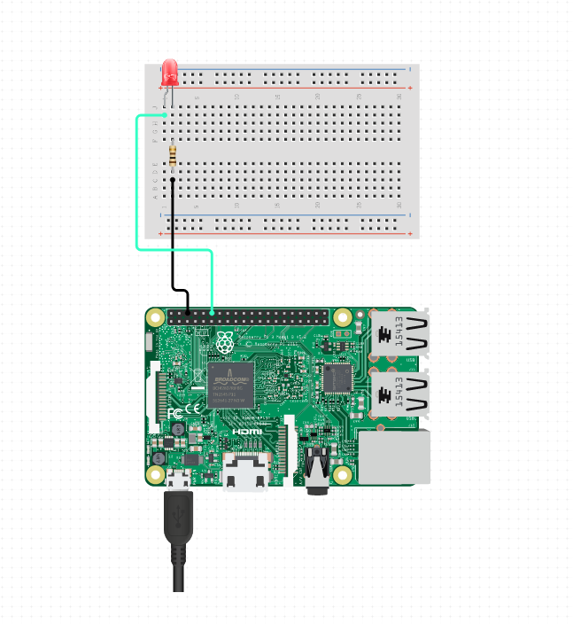

# Setting up your hardware

Before starting with this set of labs, you will need to check that your hardware is set up as suggested.

## Preparation

- Complete the steps to [assemble your hardware](../../Lab0_SetUp/1b_Assemble_your_FarmBeats_Student_Kit_Hardware.md) according to the guide in Lab0_Setup  

- Verify that the Capacitive Soil Moisture Sensor is plugged into socket A2 of the Grove Base Hat

- Verify that the Temperature, Humidity and Barometer Sensor (BME280) is plugged into the bottom left I2C socket of the Grove Base Hat.

## Optional LED Setup - Grove LED Module

For this lab, you have the option to set up an LED to light up when your soil moisture is below the optimal level for your plant.

If you wish to do this, you will need the [Grove - Red LED](https://wiki.seeedstudio.com/Grove-Red_LED/) module. You are able to connect the Red LED to any GPIO Port on the Grove base.

## Optional LED Setup - LED Component Breadboard

Otherwise, you can use a standard LED component, a breadboard, a 330Ohm resistor, and some jumper breadboard wires instead. The parts you will need are listed below:

LED Module

Breadboard

A solderless breadboard is a construction base for prototyping of electronics. You will need this to connect all your components together.

Male to Female Jumper Wires. You will need at least two of these.

Resistor (A resistance of 220 Ohms to 1 kOhm are acceptable). You always need a resistor when connected an LED component to a Raspberry Pi GPIO (General Purpose Input/Output) port in order to limit the current. This is necessary to avoid blowing your LED.

Please arrange your components as per the circuit diagram below. You may use any of the [GPIO ports](https://pinout.xyz/#) on your Raspberry Pi for this, but make sure that this is reflected in the code. 

## Additional Notes

You will not need the light sensor for this scenario, you may disconnect it from your sensor device if you wish.

