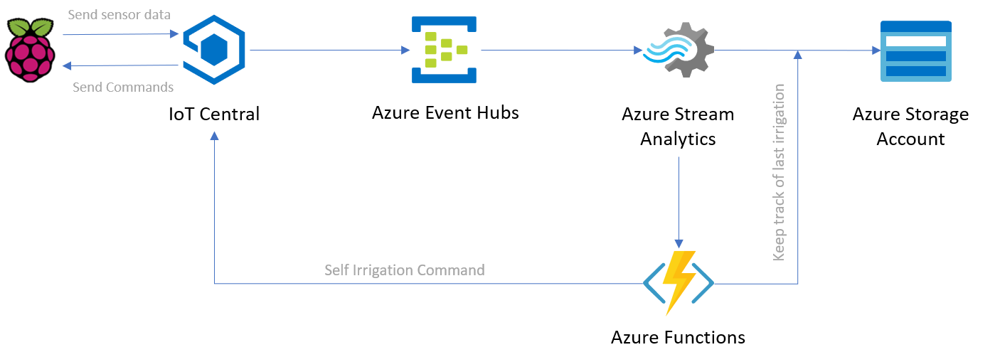

# Scenario 2: Water Your Plant

## Description

Learn how to start processing sensor data collected from your device using Azure Functions.

This scenario is divided into the following labs:

1. [Set up a notification system](Alarm_system/readme.md)

1. [Set up an automated irrigation system](Automated_irrigation/readme.md)

1. [Integrate weather prediction using Azure Maps](Weather_prediction/readme.md)

## Learning Outcomes

- Learn to integrate Azure IoT Central with other services using
    - Rules and actions.
    - REST APIs.

- Learn how to use Azure Functions

    - Use Events Hub and Stream Analytics to stream data into an Azure Function Application.
    - Deploy your own Azure Function.
    
- Understand how one can start analysing environment data to obtain actionable insights.

## Key areas to teach

App (IoT Central and Power Apps), Real-time data pipeline (Events Hub and Stream Analytics) + Azure Functions.

## Azure Services Integration

### Automated Irrigation System

## Steps

### 

1. [Create IoT Cental Template](Device_Template_IoTC.md)

1. [Create rules in IoT Central](IoT_Central_create_rule.md)

1. [Send email from python script in Raspberry Pi](AlarmSystem.md)

1. [Modify python code to listen to commands](Modify_python_code.md)

1. [Create Azure Function](Create_Azure_function.md)

1. [Execute IoT Command](Execute_IoT_Command.md)

1. [Create Stream Analytics](Create_stream_analytics.md)

1. [Integration of Azure Maps](Azure_maps.md)
