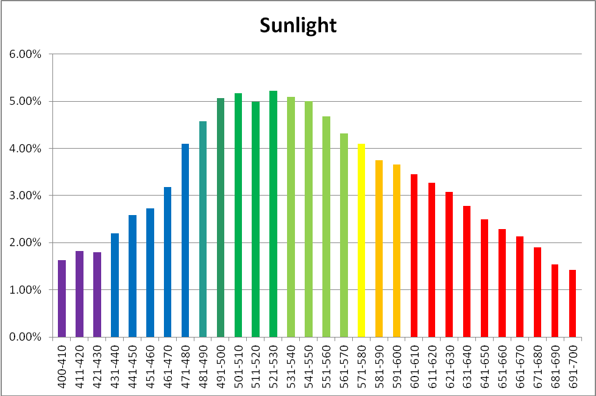

# Scenario 4: LED Light system

All plants require two fundamental resources for a correct growing: water and light. In this scenario, the student will try to use LED lights to improve the plant growth.

Different wavelenghts (colors) have different effects on the plant.:

- Blue light (450-495nm):

    - Encourage vegetative leaf growth (improves growth rate)

    - Formation of chlorophyll enables the plant to intake more energy from the sun.

- UV (100-400nm): 

    - Worsens growth

- Violet light (380-445nm):

    - Enhances the colour, taste and aroma of plants.

    - Better antioxidants.

- Green (495-570nm):

    - Similar effect to blue but less efficient

    - Enhances chlorophyll production
- Red (635-590nm):

    - Combined with blue light -> more leaves and crops

For instance sunlight has all wavelenghts, but not in the same amount. It contains more green light than red as shown in the picture below.

## Description

In this scenario, students will be able to build their own LED light system to optimises plant growth.

There is also an optional part that tries to use the sensor data to decide which colour should be light on.

_**Additional equipment:** x3 LED lights (red, blue, violet). If you dont have these colours, you can use white LEDs and paint them on the outside. Prepare more than one per colour._

## Learning Outcomes

- Learn how to use the data collected from the light intensity sensor.

- Build confidence with using IoT Central.

- Understand the importance of lighting quality/conditions in agriculture.

- Investigate using PWM for dimming techniques.

## Key areas to teach

Microsoft Azure Services, Voltage regulation/PWM.

## Steps

1. [Create a new IoT Central Template](Create_new_iotc_template.md)

1. [Write the python code for controlling the LEDs](Write_the_python_code.md)

1. [Optional: Manage LED according to sensor data](Optional.md)
