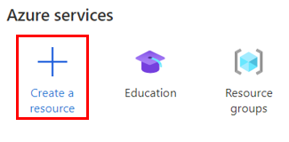
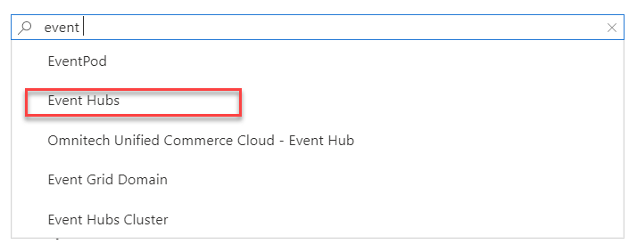
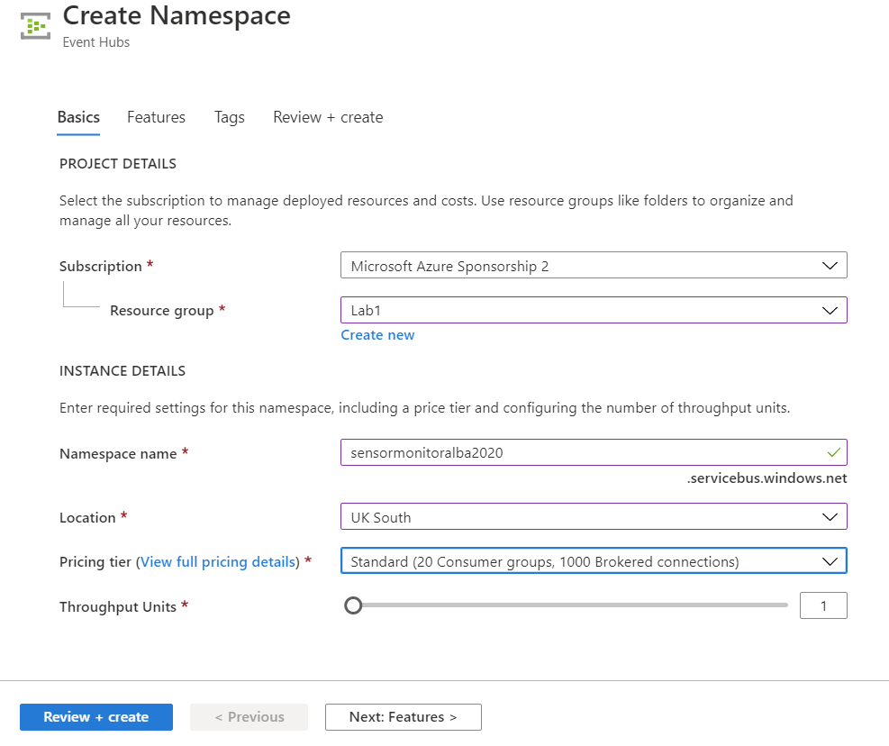
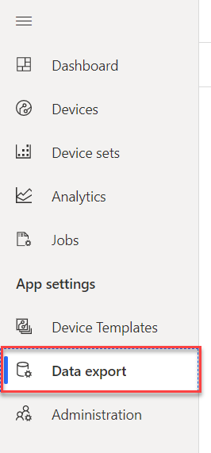
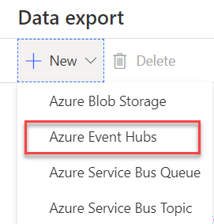
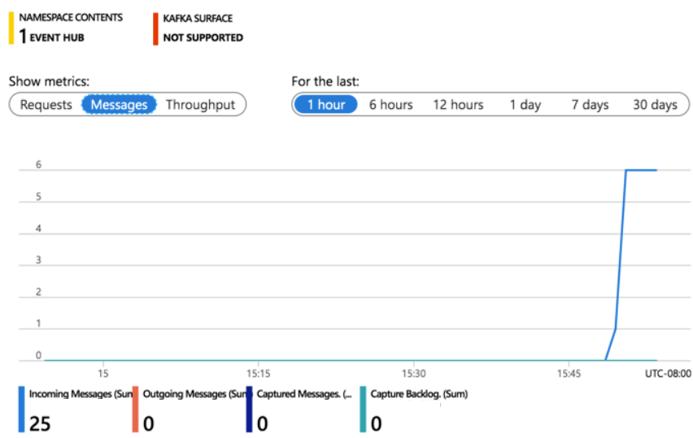

# Export Data telemetry data to Event Hubs

In the [previous step](Send_data_to_IoTCentral.md), you wrote the code to capture telemetry from the Raspberry Pi. In this step, you will export IoT telemetry to Azure Event Hubs.

## Azure Event Hubs

[Azure Event Hubs](https://azure.microsoft.com/services/event-hubs/#features?WT.mc_id=agrohack-github-jabenn) allow you to take streaming data and connect it to other services, such as storing the data or using Azure Stream Analytics to analyze the data in real time. Azure IoT Central can be configured to stream data to an Azure Event Hubs instance.

To export data you will need an Azure account.

## Creating the Event Hub Namespace

1. Open the [Azure Portal](https://portal.azure.com/).

1. Log in with your Microsoft account if required

1. Click on **+ Create a resource**.

   

1. Search for `Event Hubs` and select *Event Hubs*. Then click on **Create**.

   

1. Fill in the details for the Event Hubs

   1. Give the Event Hubs a name. This needs to be globally unique, so include things such as the data or your name, for example `sensormonitoralba2020`.

   1. Leave the *Pricing Tier* as `Standard`

   1. Select your Azure subscription

   1. For the *Resource group*, select `Lab1`.

   1. Select a *Location* closest to you

   1. Leave the rest of the options as the defaults

   

1. Select **Review + create**

1. Select **Create**

1. Once the deployment has completed, select the **Go to resource** button.

## Create the event hub

1. From the Event Hub Namespace in the Azure Portal, select **+ Event Hub**

   

1. Name the Event Hub `Telemetry`

1. Leave the rest of the options as the defaults

1. Select **Create**

## Set up data export

Azure IoT Central can export data to a number of different services, either to route the data to multiple other services, or to store data. For example, it can send IoT messages to Azure Event Hubs, and other services can listen on these events and respond - maybe by running code to process each message.

### Create the data export

1. Open the app in Azure IoT Central.

1. Select **Data export** from the left-hand menu.

   

1. Select the **New** button, then select the **Azure Event Hubs** option.

   

1. Give the export a name, such as `Export telemetry`.

1. Select the Azure Event Hubs Namespace you just created, along with the Event Hub.

1. In the *Data to export* section, leave *Telemetry* turned on, and turn off *Devices* and *Device templates*.

1. Select **Save**.

1. The new data export job will appear in the list, showing a status. Wait until the status shows *Running*, this will only take about 30 seconds or so.

### Monitor the data export

The easiest way to see messages flowing to the Event Hub is via the Azure Portal.

1. Open the [Azure Portal](https://portal.azure.com/?WT.mc_id=agrohack-github-jabenn)

1. Log in with your Microsoft account if required

1. If you are not on the blade for the event hub you created, search for it by typing the name of the namespace into the search box at the top of the portal, and selecting the Event Hubs Namespace under the *Resources* section

1. In the *Overview* tab you should see message throughput on the graph

   

----------------

[Next Step](Create_storage_account.md): In the next step you will create a storage account to save the telemetry data.
