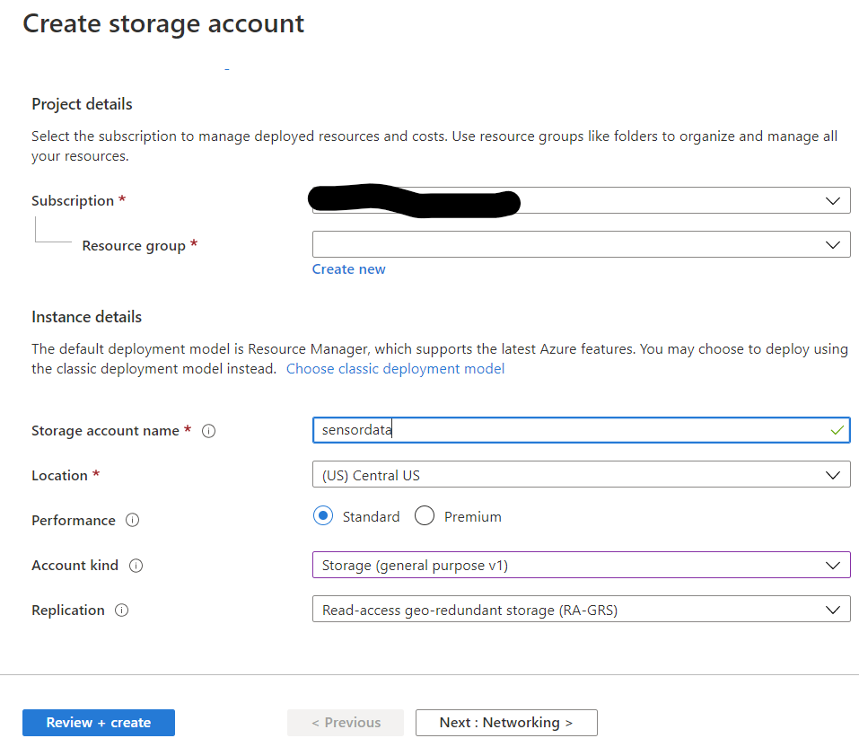
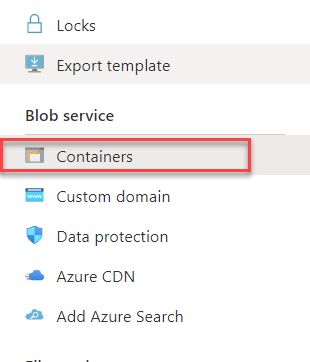
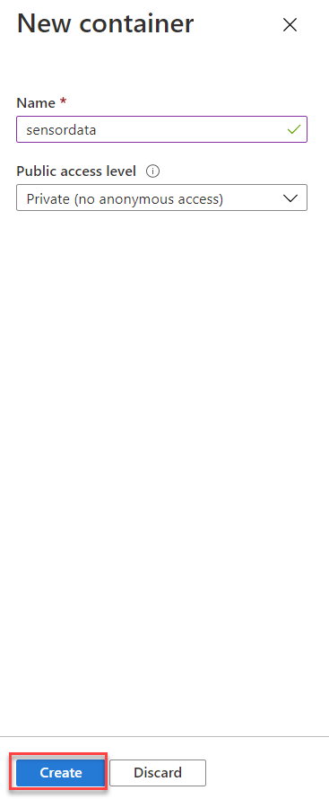

# Create Storage Account to store sensor data

In the [previous step](./Create_event_hubs.md), you have exported the data from IoT Centrall to Event Hubs. Now you will create a storage account to store all the telemetry data into a table.

## Azure Blob Storage

[Azure blob storage](https://azure.microsoft.com/services/storage/blobs/?WT.mc_id=agrohack-github-jabenn) allows you to store blobs of unstructured data that can be easily access from other Azure services, such as Azure ML Studio.

Azure has a concept of [storage accounts](https://docs.microsoft.com/azure/storage/common/storage-account-overview/?WT.mc_id=agrohack-github-jabenn), which wrap a range of storage services including file, table and blob. Blob storage uses collections to store different data in.

If you already have an existing storage account, you can skip this step go to **Create a Blob Container**.

### Create a Storage Account

1. Log into your [Azure Portal](https://portal.azure.com/)

1. Click on **+ Create a Resource**.

    

1. Search `storage account` in the search bar and select **Storage account - blob, file, table, queue**. Then click on create.

    

1. Fill in the Project details as follows:

    * Subscription: choose your own subscription.

    * Resource group: choose `Lab1`.

    * Storage account name: choose something like `sensorMonitor`.

    * Region: Choose your region.

    * Performance: choose standard.

    * Account kind: `Storage (general purpose 1)`.

    

1. Once you are done click on **Review + create**. And the click on create.

1. Wait for the deployment to be finished. After that select **Go to resource**.

### Create Blob Container

1. On the Left panel, under **Blob Service** go to **Containers**.

    

1. Click on **+ Container** to create a new container.

    

1. Name the container `sensordata` and click on **save**.

    

---------------

[Next step](./Create_stream_analytics.md): Create stream analytics to tranfer the events from the IoT Hub to the table in the Storage account.
