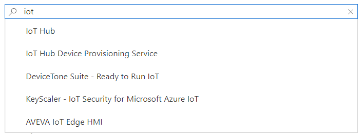
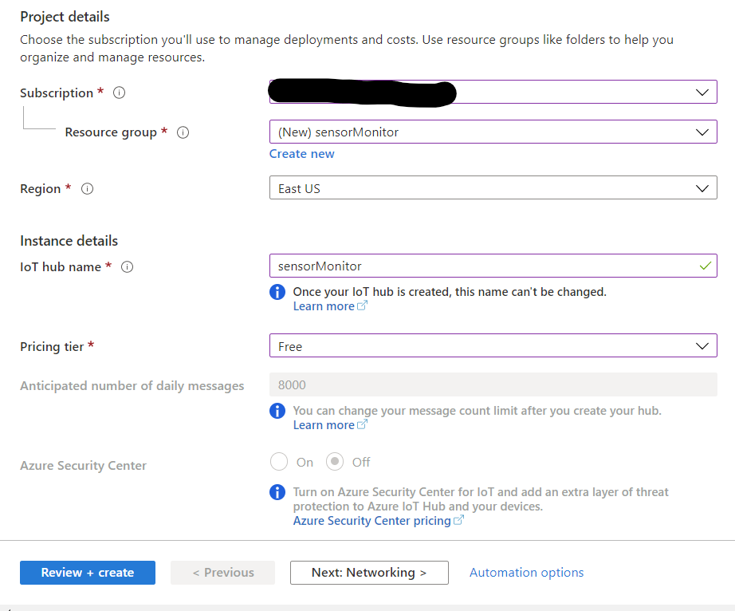
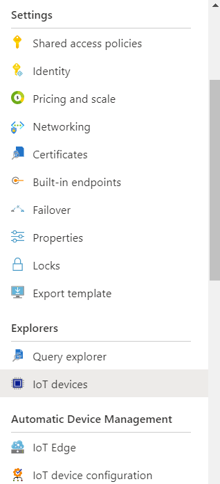
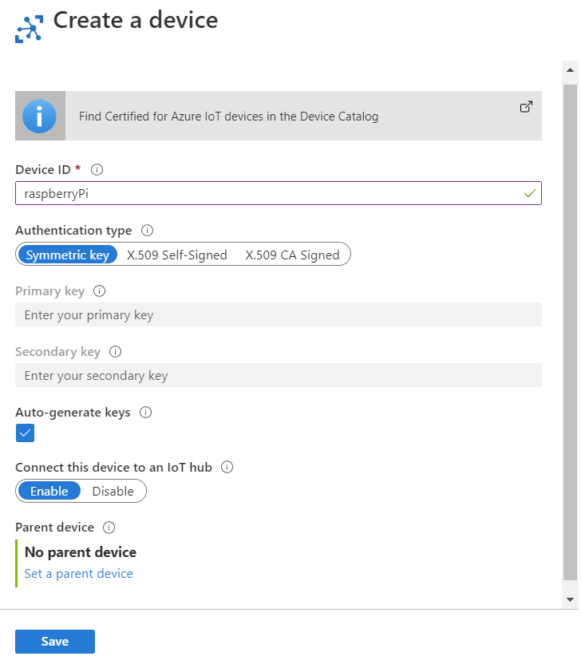

# Create IoT Hub to be able to receive events

In this step you will create an [IoT hub](https://azure.microsoft.com/services/iot-hub/#overview) to receive events from the Raspberry Pi. IoT Hub is a platform made for IoT devices that makes communication between devices easier. It allows us to have a bidirectional communication with enhaced security.

## Create IoT Hub Resource

1. Log into your [Azure Portal](https://portal.azure.com/)

1. Click on `+ Create a Resource`.

    

1. Search IoT Hub in the search bar and select IoT Hub. Then click on **Create**.

    

1. Fill in the Project details as follows:

    * Subscription: choose your own subscription.

    * Resource group: click on **Create new** and name it something like `sensorMonitor`.

    * Region: Choose your region.

    * IoT hub name: choose something like `sensorMonitor`.

    * Pricing Tier: you can just use the free pricing tier.

    

1. Once you are done click on **Review + create**. And the click on **Create**.

1. Wait for the deployment to be finished. After that select **Go to resource**.

## Create IoT Device

1. On the left panel, go to *Explorers* > *IoT Devices*.

    

1. Click on **+ Add** to create a new device.

    

1. Name the device `raspberryPi` and leave the save as it is. Click on save.

    

1. After creating it, a new device should appear. Just click on it and take a note of the **Primary connection string**. You will need it later to stablish a connetion between your raspberry pi and IoT Hub.

    

----------

[Next step](Python_code.md): Write the code for the Raspberry Pi to stablish a connection with the IoT Hub.
