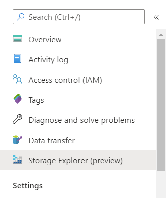
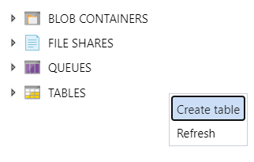
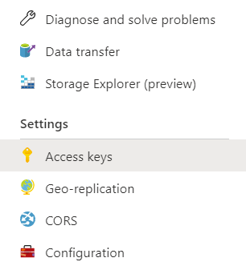

# Create Storage Account to store sensor data

In the [previous step](./Python_code.md), you have established a connection between your Raspberry Pi and IoT Hub. Now you will create a storage account to store all the telemetry data into a table.

## Azure Table Storage

[Azure Table Storage](https://azure.microsoft.com/services/storage/tables/) allows you to store up to petabytes of structure data, and access them using a key-value approach.

Azure has a concept of [storage accounts](https://docs.microsoft.com/azure/storage/common/storage-account-overview/?WT.mc_id=agrohack-github-jabenn), which wrap a range of storage services including file, table and blob. Blob storage uses collections to store different data in.

If you already have an existing storage account, you can skip this step go to **Create a table**.

### Create a Storage Account

1. Log into your [Azure Portal](https://portal.azure.com/)

1. Click on **+ Create a Resource**.

    

1. Search `storage account` in the search bar and select **Storage account - blob, file, table, queue**. Then click on **Create**.

    

1. Fill in the Project details as follows:

    * Subscription: choose your own subscription.

    * Resource group: choose `sensorMonitor`.

    * Storage account name: choose something like `sensorMonitor`.

    * Region: Choose your region.

    * Performance: choose standard.

    * Account kind: `Storage (general purpose 1)`.

    

1. Once you are done click on **Review + create**. And the click on create.

1. Wait for the deployment to be finished. After that select **Go to resource**.

### Create a table

1. On the Left panel, go to **Storage Explorer (preview)**.

    

1. Right click on *Tables* > *Create table*. Name the table `data`.

    

### Get the connection string

1. On the left panel, go to *Settings* > *Access keys*.

    

1. Copy the **Connection string** from key 1. You will need it when creating your Azure Function.

---------------

Next step: [Create stream analytics](Create_stream_analytics.md) to tranfer the events from the IoT Hub to the table in the Storage account.
