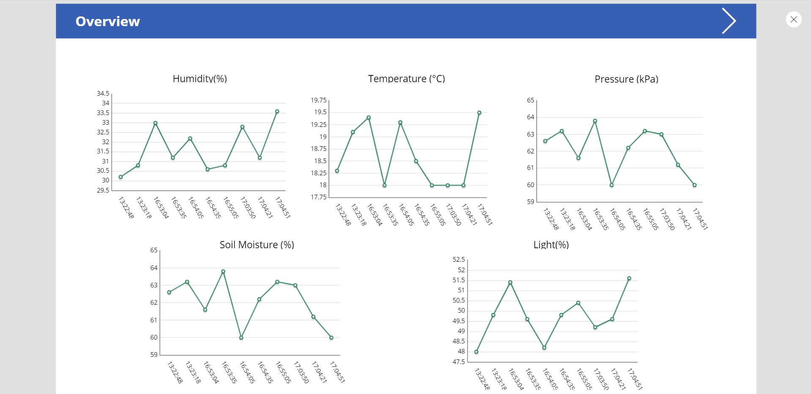
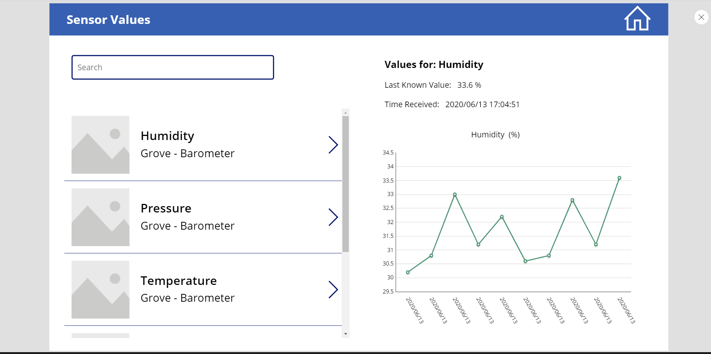

# Create the app

In this lab you will learn how to create your own app using PowerApps. PowerApps is a platform that allows us to build an app without having deep understanding in programming. It has a very user friendly interface and allows you to connect to a great variety of data sources, from excel tables to outlook and Azure Services.

## Interface of the App

This is how the app will look like after this tutorial.

There will be an overview screen where you can get an idea of the values received by the sensors.

Aditionally, in the second page, you will be able to get more detailed information. You can also add a table to display all the values.

## Steps

1. [Create IoT Hub to receive data from the Raspberry Pi](./Create_IoTHub.md)

1. [Create the code for the Raspberry Pi](./Python_code.md)

1. [Create Storage Account to store sensor measurements](./Create_storage_account.md)

1. [Use Stream Analytics Job to stream data into the storage account](./Create_stream_analytics.md)

1. [Create Azure Function](./Create_function.md)

1. [Create the Powerapp](./Create_PowerApps.md)
