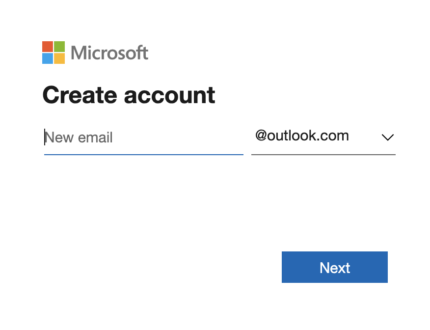
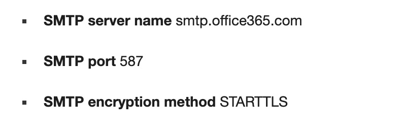

# **2. Set up an alarm system**

## Start with a email account

1. Register a new microsoft email account



2. Check for information about **Outlook mail SMTP**

- SMTP server name: smtp.office365.com
- SMTP Port TLS: 587



## Write the code
```python
import smtplib
from email.mime.text import MIMEText
# import libraries for SMTP and email related functions

import smbus2, bme280, os, asyncio, json
from dotenv import load_dotenv
from grove.grove_moisture_sensor import GroveMoistureSensor
from grove.grove_led import GroveLed
from azure.iot.device.aio import IoTHubDeviceClient, ProvisioningDeviceClient
from azure.iot.device import MethodResponse

# Configuration parameters
bme_pin = 1
bme_address = 0x76
moisture_pin = 2
led_pin = 16

# Create the sensors
bus = smbus2.SMBus(bme_pin)
calibration_params = bme280.load_calibration_params(bus, bme_address)

moisture_sensor = GroveMoistureSensor(moisture_pin)

# Create the LED
led = GroveLed(led_pin)

# Load the Azure IoT Central connection parameters
load_dotenv()
id_scope = os.getenv('ID_SCOPE')
device_id = os.getenv('DEVICE_ID')
primary_key = os.getenv('PRIMARY_KEY')

def getTemperaturePressureHumidity():
    return bme280.sample(bus, bme_address, calibration_params)

def getMoisture():
    return moisture_sensor.moisture

def getTelemetryData():
    temp_pressure_humidity = getTemperaturePressureHumidity()
    moisture = getMoisture()

    data = {
        "humidity": round(temp_pressure_humidity.humidity, 2),
        "pressure": round(temp_pressure_humidity.pressure/10, 2),
        "temperature": round(temp_pressure_humidity.temperature, 2),
        "soil_moisture": round(moisture, 2)
    }

    return json.dumps(data)


async def main():
    # provision the device
    async def register_device():
        provisioning_device_client = ProvisioningDeviceClient.create_from_symmetric_key(
            provisioning_host='global.azure-devices-provisioning.net',
            registration_id=device_id,
            id_scope=id_scope,
            symmetric_key=primary_key)

        return await provisioning_device_client.register()

    results = await asyncio.gather(register_device())
    registration_result = results[0]

    # build the connection string
    conn_str='HostName=' + registration_result.registration_state.assigned_hub + \
                ';DeviceId=' + device_id + \
                ';SharedAccessKey=' + primary_key

    # The client object is used to interact with Azure IoT Central.
    device_client = IoTHubDeviceClient.create_from_connection_string(conn_str)

    # connect the client.
    print('Connecting')
    await device_client.connect()
    print('Connected')

    # create a default alarm state
    alarm_state = False
    # set up the email credentials
    from_email_addr = 'sender_email@outlook.com'
    from_email_password = 'sender_email_password'
    to_email_addr = 'receiver_email@outlook.com'
    # set email message
    body = 'Farmbeats Alert: Your plants are thirsty!!'
    msg = MIMEText(body)
    # set sender and recipient
    msg['From'] = from_email_addr
    msg['To'] = to_email_addr
    msg['Subject'] = 'FARMBEATS ALERT!!!'

    
    # listen for commands
    async def command_listener(device_client):
        while True:
            method_request = await device_client.receive_method_request('needs_watering')
            needs_watering = method_request.payload
            print('Needs watering:', needs_watering)
            payload = {'result': True}

            if needs_watering:
                led.on()
                alarm_state = True
                print('Alarm ON')
                if alarm_state == True:
                    server = smtplib.SMTP('smtp.outlook.com', 587)
                    # connect to server and get ready to send email
                    # edit above lines with your email provider's SMTP server details
                    server.starttls()
                    # comment out this line if provider does not use TLS
                    server.login(from_email_addr, from_email_password)
                    server.sendmail(from_email_addr, to_email_addr, msg.as_string())
                    server.quit()
                    print('Email sent')
                    alarm_state = False            
                
            else:
                led.off()

            method_response = MethodResponse.create_from_method_request(
                method_request, 200, payload
            )
            await device_client.send_method_response(method_response)

    # async loop that sends the telemetry
    async def main_loop():
        while True:
            telemetry = getTelemetryData()
            print(telemetry)

            await device_client.send_message(telemetry)
            await asyncio.sleep(60)

    listeners = asyncio.gather(command_listener(device_client))

    await main_loop()

    # Cancel listening
    listeners.cancel()

    # Finally, disconnect
    await device_client.disconnect()

if __name__ == '__main__':
    asyncio.run(main())
```
The monitor email account will send alarm directly to receiver as it reaches the water threshold.

### Breakdown the code

This Python file contains code to define sensors, configure email sender &receiver and set up telemetry alarm message.

```python
import smtplib
from email.mime.text import MIMEText
# import libraries for SMTP and email related functions

import smbus2, bme280, os, asyncio, json
from dotenv import load_dotenv
from grove.grove_moisture_sensor import GroveMoistureSensor
from grove.grove_led import GroveLed
from azure.iot.device.aio import IoTHubDeviceClient, ProvisioningDeviceClient
from azure.iot.device import MethodResponse
```
This code first imports libraries for SMTP, Grove sensors and all other Azure related functions.

```python
bme_pin = 1
bme_address = 0x76
moisture_pin = 2
led_pin = 16

bus = smbus2.SMBus(bme_pin)
calibration_params = bme280.load_calibration_params(bus, bme_address)
moisture_sensor = GroveMoistureSensor(moisture_pin)
led = GroveLed(led_pin)

load_dotenv()
id_scope = os.getenv('ID_SCOPE')
device_id = os.getenv('DEVICE_ID')
primary_key = os.getenv('PRIMARY_KEY')
  ```
This part of code defines all the Grove sensors on the raspberry pi and load the Azure IoT Central parameters for later connections.

```python
def getTemperaturePressureHumidity():
    return bme280.sample(bus, bme_address, calibration_params)

def getMoisture():
    return moisture_sensor.moisture

def getTelemetryData():
    temp_pressure_humidity = getTemperaturePressureHumidity()
    moisture = getMoisture()

    data = {
        "humidity": round(temp_pressure_humidity.humidity, 2),
        "pressure": round(temp_pressure_humidity.pressure/10, 2),
        "temperature": round(temp_pressure_humidity.temperature, 2),
        "soil_moisture": round(moisture, 2)
    }

    return json.dumps(data)
```
Here we define functions to collect data from sensors and return them in JSON file.

```python
async def main():
    async def register_device():
        provisioning_device_client = ProvisioningDeviceClient.create_from_symmetric_key(
            provisioning_host='global.azure-devices-provisioning.net',
            registration_id=device_id,
            id_scope=id_scope,
            symmetric_key=primary_key)

        return await provisioning_device_client.register()

    results = await asyncio.gather(register_device())
    registration_result = results[0]

    conn_str='HostName=' + registration_result.registration_state.assigned_hub + \
                ';DeviceId=' + device_id + \
                ';SharedAccessKey=' + primary_key

    # The client object is used to interact with Azure IoT Central.
    device_client = IoTHubDeviceClient.create_from_connection_string(conn_str)

    # connect the client.
    print('Connecting')
    await device_client.connect()
    print('Connected')
  ```
An *asynchronous* main function is set up for coroutine, it first provisions the device and builds up connection string to Azure IoT Central, ensures that clients and students can interact with IoT Central by printing the current state of device.

```python
    # create a default alarm state
    alarm_state = False
    # set up the email credentials
    from_email_addr = 'sender_email@outlook.com'
    from_email_password = 'sender_email_password'
    to_email_addr = 'receiver_email@outlook.com'
    # set email message
    body = 'Farmbeats Alert: Your plants are thirsty!!'
    msg = MIMEText(body)
    # set sender and recipient
    msg['From'] = from_email_addr
    msg['To'] = to_email_addr
    msg['Subject'] = 'FARMBEATS ALERT!!!'
```
Then we create an *Alarm State*. Put the *Alarm State* to *False* as its default state. Here we also set up credentials for email sender and receiver. Editting alarm message and its subject title in *body* and *msg[subject]*, respectively.

```python
    async def command_listener(device_client):
        while True:
            method_request = await device_client.receive_method_request('needs_watering')
            needs_watering = method_request.payload
            print('Needs watering:', needs_watering)
            payload = {'result': True}

            if needs_watering:
                led.on()
                alarm_state = True
                print('Alarm ON')
                if alarm_state == True:
                    server = smtplib.SMTP('smtp.outlook.com', 587)
                    # connect to server and get ready to send email
                    # edit above lines with your email provider's SMTP server details
                    server.starttls()
                    # comment out this line if provider does not use TLS
                    server.login(from_email_addr, from_email_password)
                    server.sendmail(from_email_addr, to_email_addr, msg.as_string())
                    server.quit()
                    print('Email sent')
                    alarm_state = False            
                
            else:
                led.off()

            method_response = MethodResponse.create_from_method_request(
                method_request, 200, payload
            )
            await device_client.send_method_response(method_response)
```
In this part of the code, the function waits for 'needs_watering' instruction from *__init__.py*, which compares moisture readings with the threshold we set before. If the data is below the threshold, LED light would turn on and the *Alarm State* will be switched to TRUE at the same time. Alarm message we set before then will be sent to email receiver. After message has been sent, *Alarm State* will go back to its default state.
