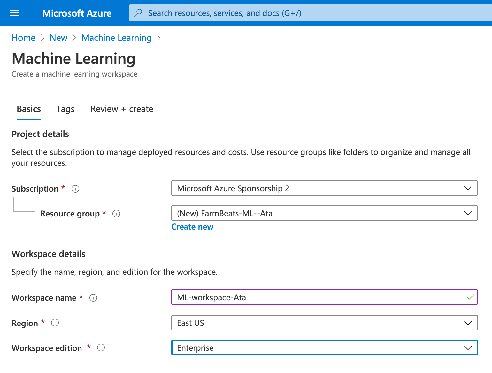

## Create an Azure Machine Learning workspace

To use Azure Machine Learning, you create a workspace in your Azure subscription. You can then use this workspace to manage data, compute resources, code, models, and other artifacts related to your machine learning workloads.

1. Sign into the [Azure portal](https://portal.azure.com/#home)

1. Select **＋Create a resource**, search for Machine Learning, and create a new **Machine Learning** resource with the following settings:

    1. **Workspace Name**: A unique name of your choice such as `ML-workspace-Ata`
    
    1. **Subscription**: Your Azure subscription

    1. **Resource group**: Create a new resource group with a unique name suc as `FarmBeats-ML-Ata`

    1. **Location**: Choose any available location

    1. **Workspace edition**: Enterprise
    
    

1. Wait for your workspace to be created (it can take a few minutes). Then go to it in the portal.

1. On the Overview page for your workspace, launch Azure Machine Learning Studio (or open a new browser tab and navigate to https://ml.azure.com ), and sign into Azure Machine Learning studio using your Microsoft account.

1. In Azure Machine Learning studio, you can use the pages under ☰ icon to manage the resources in your workspace.

## Create compute resources

To train and deploy models using Azure Machine Learning designer, you need compute resources on which to run the training process, test the model, and host the model in a deployed service.

### Create compute targets

Compute targets are cloud-based resources on which you can run model training and data exploration processes. In Azure Machine Learning studio, view the **Compute** page (under **Manage**). This is where you manage the compute targets for your data science activities. There are four kinds of compute resource you can create:

1. **Compute Instances**: Development workstations that data scientists use to work with data and models. On the Compute Instances tab, add a new compute instance with the following settings. You'll use this to test your model:

    1. Compute name: enter a unique name

    1. Virtual Machine type: CPU

    1. Virtual Machine size: Standard_DS2_v2
  
1. **Compute Clusters**: Scalable clusters of virtual machines for on-demand processing of experiment code. While the compute instance is being created, switch to the Compute Clusters tab and add a new compute cluster with the following settings. You'll use this to train a machine learning model:
    
    1. Compute name: enter a unique name
    
    1. Virtual Machine size: Standard_DS2_v2
    
    1. Virtual Machine priority: Dedicated
    
    1. Minimum number of nodes: 2
    
    1. Maximum number of nodes: 2
    
    1. Idle seconds before scale down: 120
  
1. **Inference Clusters**: Deployment targets for predictive services that use your trained models.
  
    1. **Compute name**: enter a unique name

    1. **Kubernetes Service**: Create new

    1. **Region**: Select a different region than the one used for your workspace

    1. **Virtual Machine size**: Standard_DS2_v2 (Use the filter to find this in the list)

    1. **Cluster purpose**: Dev-test

    1. **Number of nodes**: 2

    1. **Network configuration**: Basic
    
    1. **Enable SSL configuration**: Unselected  

1. **Attached Compute**: Links to existing Azure compute resources, such as Virtual Machines or Azure Databricks clusters. You don't have to attach a new compute for now.

The compute targets will take some time to be created. You can move onto the next unit while you wait.

> In a production environment, you'd typically set the **minimum number of nodes** value to 0 so that compute is only started when it is needed. However, compute can take a while to start, so to reduce the amount of time you spend waiting for it, you've initialized it with two permanently running nodes for this module.
  

## Explore data

To train a model, you need a dataset that includes historical features (characteristics of the entity for which you want to make a prediction) and known label values (the numeric value that you want to train a model to predict).

### Create a pipeline

To use the Azure Machine Learning designer, you create a pipeline that you will use to train a machine learning model. This pipeline starts with the dataset from which you want to train the model.

1. In Azure Machine Learning studio , view the **Designer** page (under **Author**), and select **+** to create a new pipeline.

1. In the **Settings** pane, change the draft pipeline name (**Pipeline-Created-on-date**) to **Chance of Rain Training** (if the Settings pane is not visible, select the ⚙ icon next to the pipeline name at the top).

1. Observe that you need to specify a compute target on which to run the pipeline. In the **Settings** pane, use **Select compute target** to select the compute cluster you created previously.

### Add and explore a dataset

