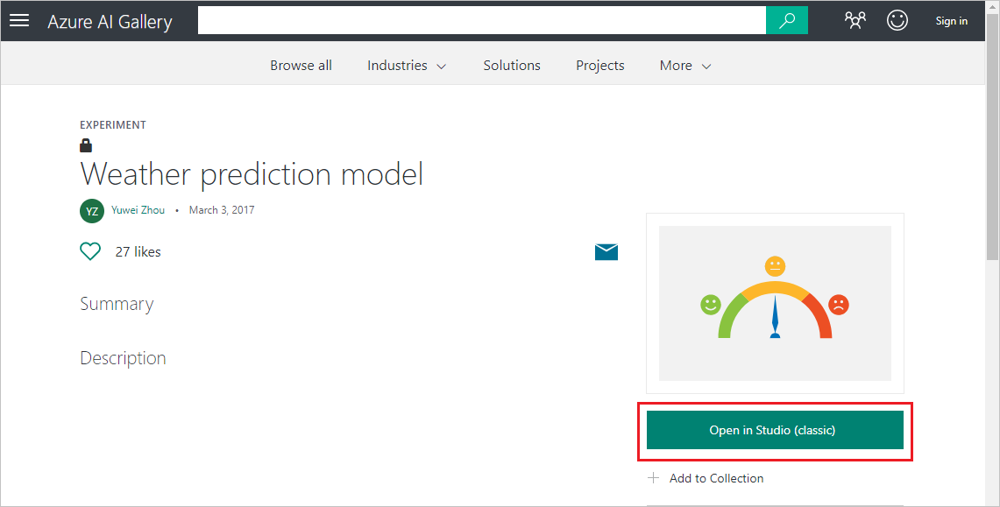
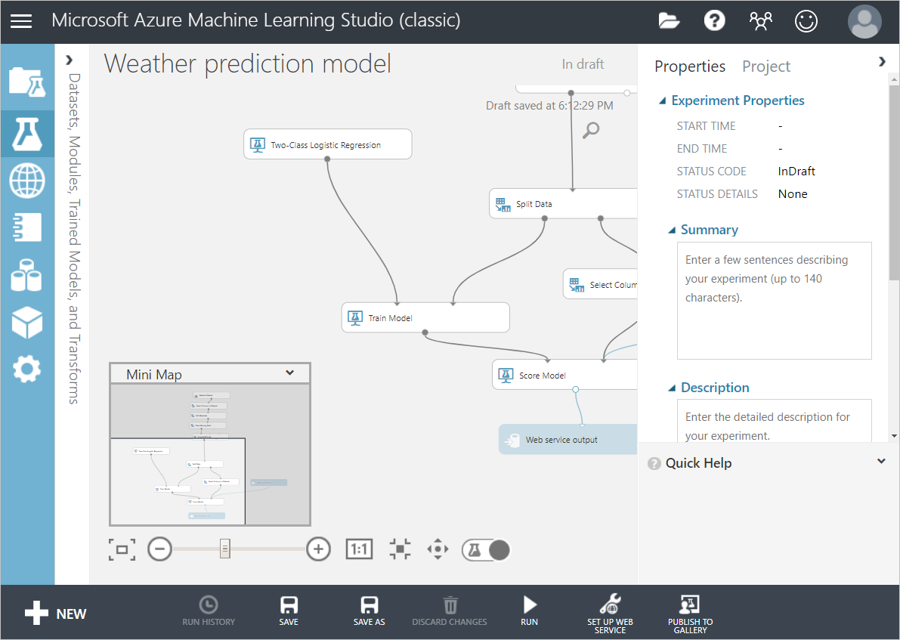
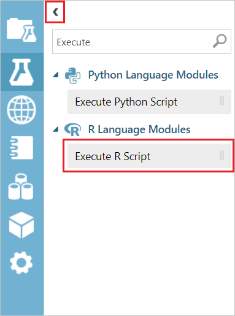
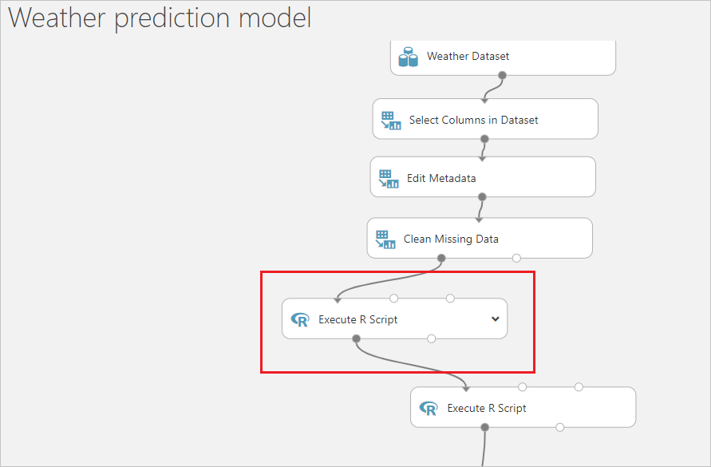
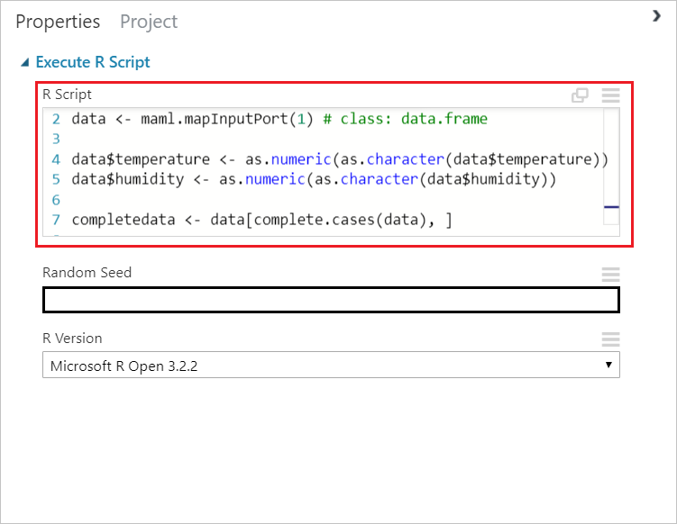
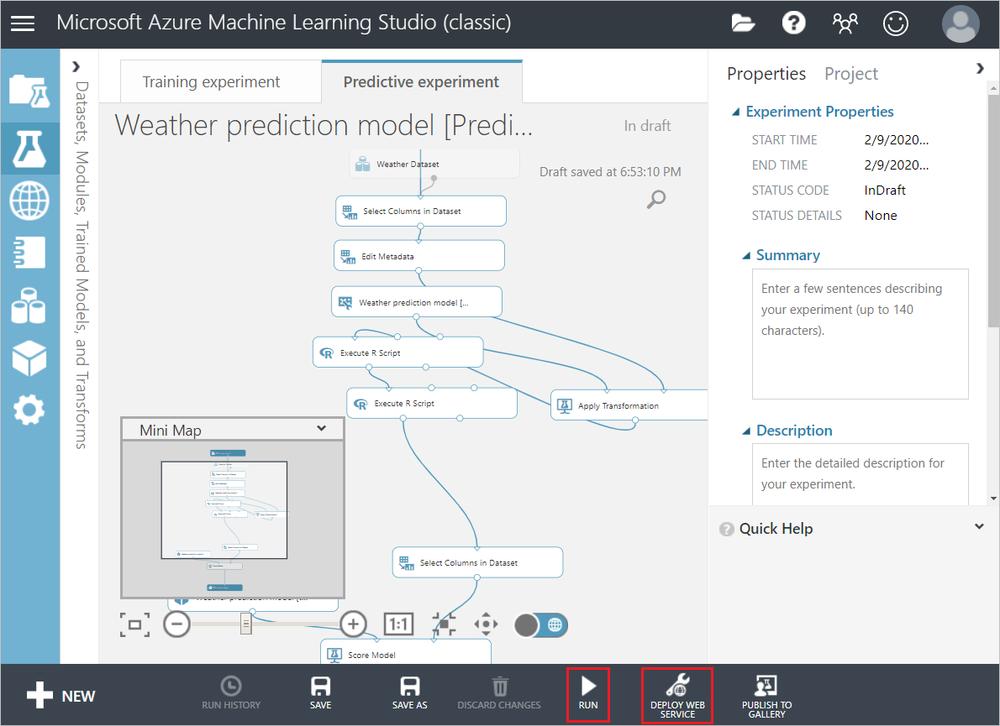
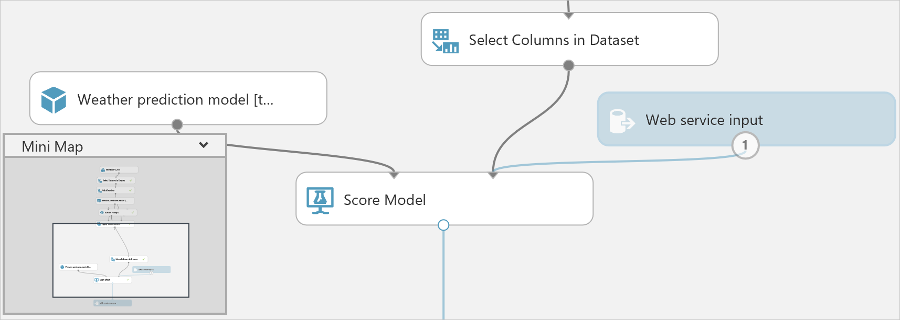
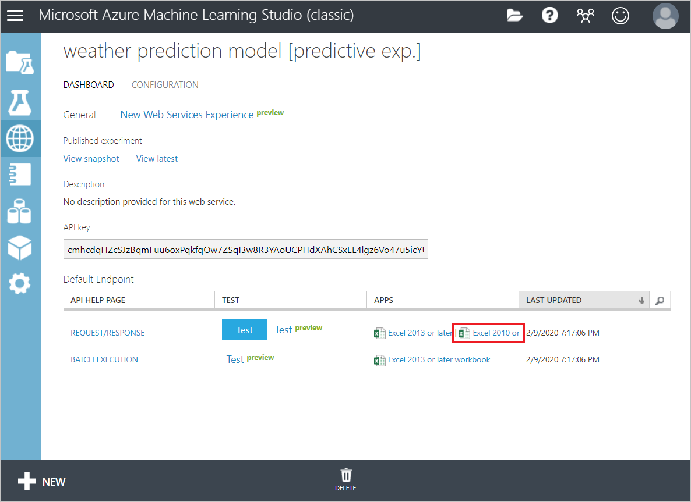

# **Scenario 3: Predict the weather**

## **Description**

Predict the chance of rain using machine learning to use it as a factor for the automatic irrigation system. There is no need to water the plant if there is a high chance of rain. The chance of rain is the output of a prepared weather prediction model. The model is built upon historic data to forecast chance of rain based on temperature and humidity. 

> You could compare the output of this model with that of Azure Maps in the previous step to check its validity.

## **Learning Outcomes**

- Learn how to use the sensor data in a machine learning model and use its output to trigger a command in IOT Central.

- Learn how to use Azure Machine Learning Studio (classic) to do weather forecast (chance of rain) using the temperature and humidity data obtained from your Azure Event Hubs.

## **Key areas to teach**

AI, Azure services, Azure Machine Learning Studio (classic).


### Deploy the weather prediction model as a web service

In this section you get the weather prediction model from the Azure AI Library. Then you add an R-script module to the model to clean the temperature and humidity data. Lastly, you deploy the model as a predictive web service.


#### Get the weather prediction model

1. Go to the [weather prediction model page](https://gallery.azure.ai/Experiment/Weather-prediction-model-1)

    
 
1. Click **Open in Studio (classic)** to open the model in Microsoft Azure Machine Learning Studio (classic).

    


#### Add an R-script module to clean temperature and humidity data

Add an R-script module to the weather prediction model that removes any rows that have data values for temperature or humidity that cannot be converted to numeric values.

1. On the left-side of the Azure Machine Learning Studio window, click the arrow to expand the tools panel. Enter "Execute" into the search box. Select the **Execute R Script** module.

    

1. Drag the **Execute R Script** module near the **Clean Missing Data** module and the existing **Execute R Script** module on the diagram. Delete the connection between the **Clean Missing Data** and the Execute R Script modules and then connect the inputs and outputs of the new module as shown.

    

1. Select the new **Execute R Script** module to open its properties window. Copy and paste the following code into the **R Script** box.

    ```R
    # Map 1-based optional input ports to variables
    data <- maml.mapInputPort(1) # class: data.frame

    data$temperature <- as.numeric(as.character(data$temperature))
    data$humidity <- as.numeric(as.character(data$humidity))

    completedata <- data[complete.cases(data), ]

    maml.mapOutputPort('completedata')
    
    ```
    The properties window should look similar to the following:
    
    
    
    
#### Deploy predictive web service

Now we validate the model, set up a predictive web service based on the model and then deploy the web service.

1. Click **Run** to validate the steps in the model. This step might take a few minutes to complete.

    

1. Click **SET UP WEB SERVICE > Predictive Web Service**. The predictive experiment diagram opens.

    

1. In the predictive experiment diagram, delete the connection between the **Web service input** module and the **Weather Dataset** at the top. Then drag the **Web service input** module somewhere near the **Score Model** module and connect it as shown:

    
    
1. Click **RUN** to validate the steps in the model.

1. Click **DEPLOY WEB SERVICE** to deploy the model as a web service.

1. On the dashboard of the model, download the **Excel 2010 or earlier workbook** for **REQUEST/RESPONSE**.
    
    
    
1. Open the Excel workbook, make a note of the **WEB SERVICE URL** and **ACCESS KEY**. (You will need these later)
    

### Add a consumer group to your Event hub

[Consumer groups](https://docs.microsoft.com/en-us/azure/event-hubs/event-hubs-features#event-consumers) provide independent views into the event stream that enable apps and Azure services to independently consume data from the same Event Hub endpoint. In this section, you add a consumer group to your Event hub's built-in endpoint. We use this later in the tutorial to pull data from the endpoint.

To add a consumer group to your Event hub, follow these steps:

1. In the [Azure portal](https://portal.azure.com/#home), open your Event Hubs Namespace and go into the event hub you created previously.
    
    

-----------------
