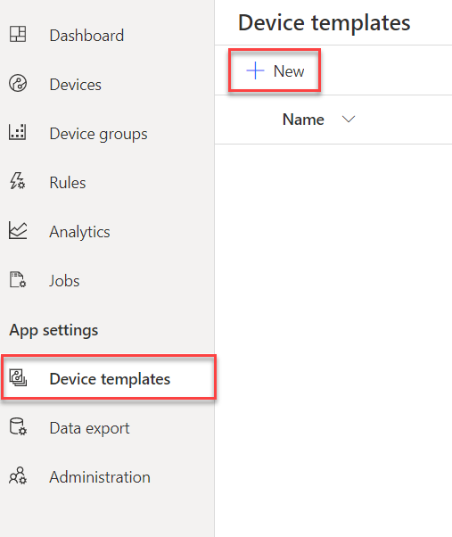
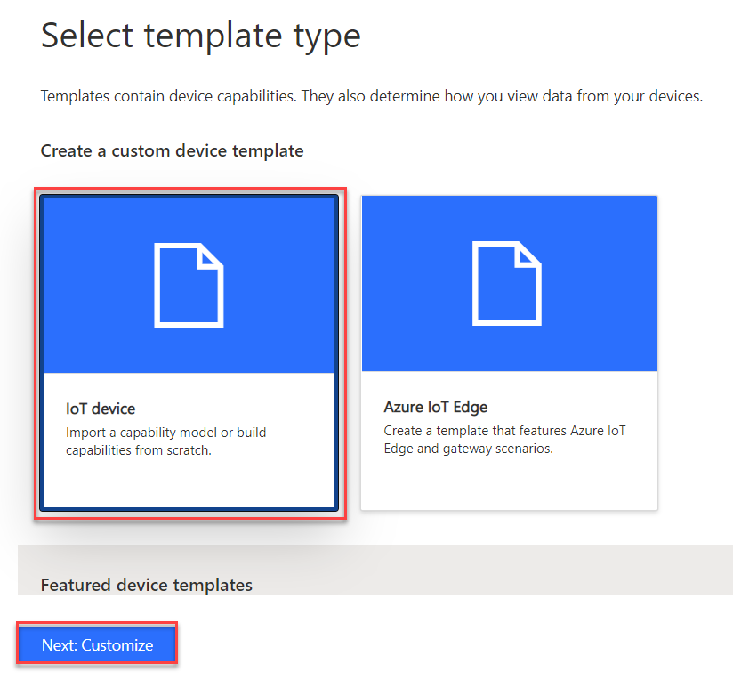
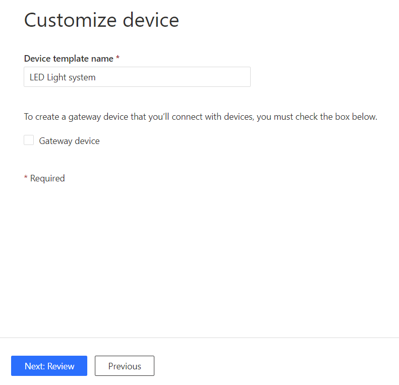
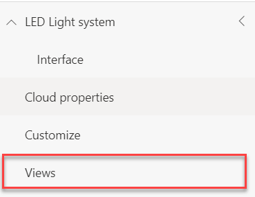
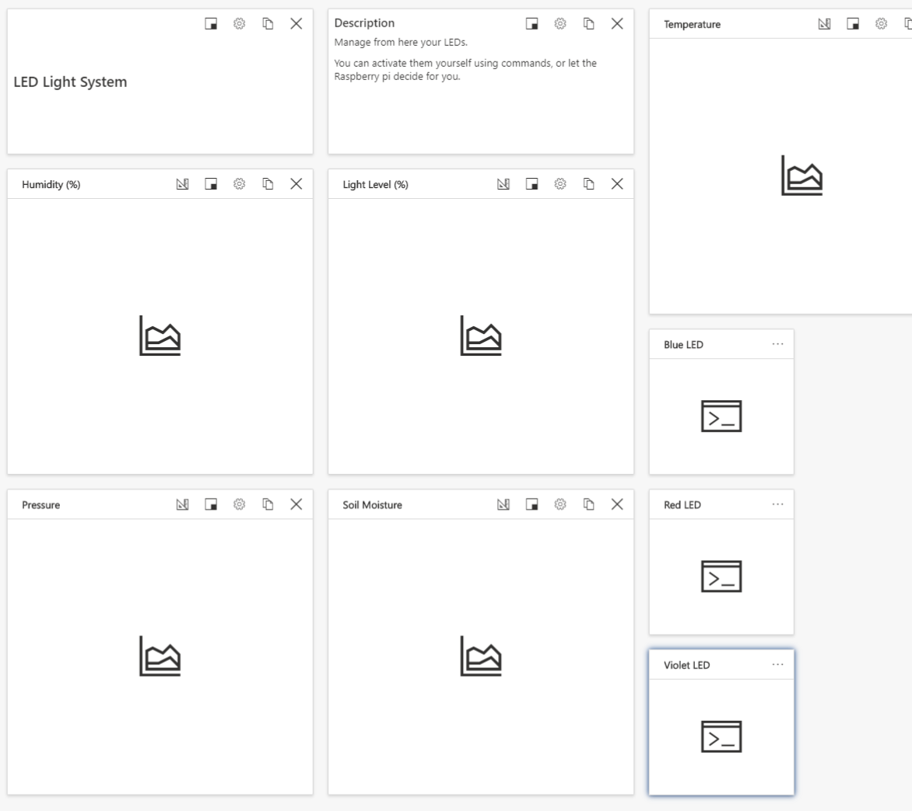
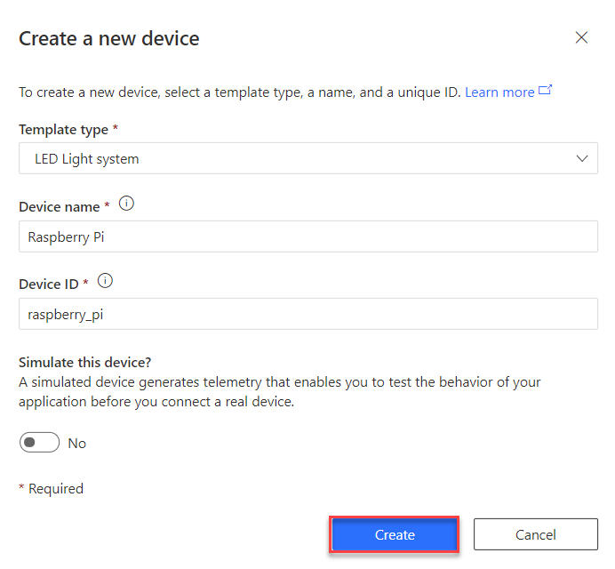
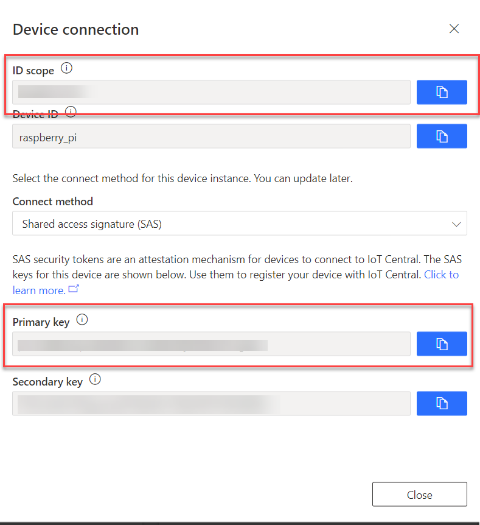

# Create a new IoT Central application template

In this step you will create a new IoT Central application template similar to lab one but with added commands for controlling the LEDs. 

## Create a new template

1. Go to your IoT Central application created in lab 1.

1. Go to *Device templates > + New*.

    

1. Click on **IoT device** and then click on **New: Customize**.

    

1. Name the Device template `LED Light System`. Then click on **Next: Review**.

    

1. Finally click on **Create**.

## Create the Capability Model

1. For Capability model choose **Custom**.

1. Click on **+ Add Interface**.

    

1. Select **Custom** inteface.

1. In this case the Sensor measures should the same as lab 1. We still want to see the sensor values in our application. 

   |  Display Name     | Name          | Capability Type | Semantic Type | Schema | Unit |
   | -------------     | ------------- | --------------- | ------------- | ------ | ---- |
   | Temperature       | temperature   | Telemetry       | Temperature   | Double | °C   |
   | Pressure          | pressure      | Telemetry       | Pressure      | Double | kPa  |
   | Humidity (%)      | humidity      | Telemetry       | Humidity      | Double | %    |
   | Soil Moisture (%) | soil_moisture | Telemetry       | None          | Double | % |
   | Light Level (%)   | light_level   | Telemetry       | None          | Double | % |

1. Additionally, you will also add come commands to control the LED lights.

   |  Display Name     | Name          | Capability Type |
   | ---------------   | ------------- | --------------- |
   | Red LED           | red_led       | Command         |
   | Blue LED          | blue_led      | Command         |
   | Violet LED        | violet_led    | Command         |

1. Turn on Request for the command and set the following values:

   |  Display Name     | Name          | Schema   |
   | ---------------   | ------------- | -------- |
   | Red LED           | red_led       | Double   |
   | Blue LED          | blue_led      | Double   |
   | Violet LED        | violet_led    | Double   |

1. Click on **Save**.

    

1. Now go to the **Views** tab.

    

1. Select **Visualizing the device**.

1. Your view may look like this:

    

1. Then Click on **Publish**. Recall that if you want to change anything after publishing, you will need to publish it again. 

## Create a new device

1. Now go to the **Devices** tab on the left hand side panel.

1. Click on **+ New** and fill in the details as follows.

    

1. Click on the device you have just created, then go to **Connect** and copy the **ID scope** and **Primary key**, just as in the first lab.

    

-------------------

Next Step: [Modify the python code used in Lab 1](Write_the_python_code.md), and incorporate a listener to receive commands from IoT Central.
