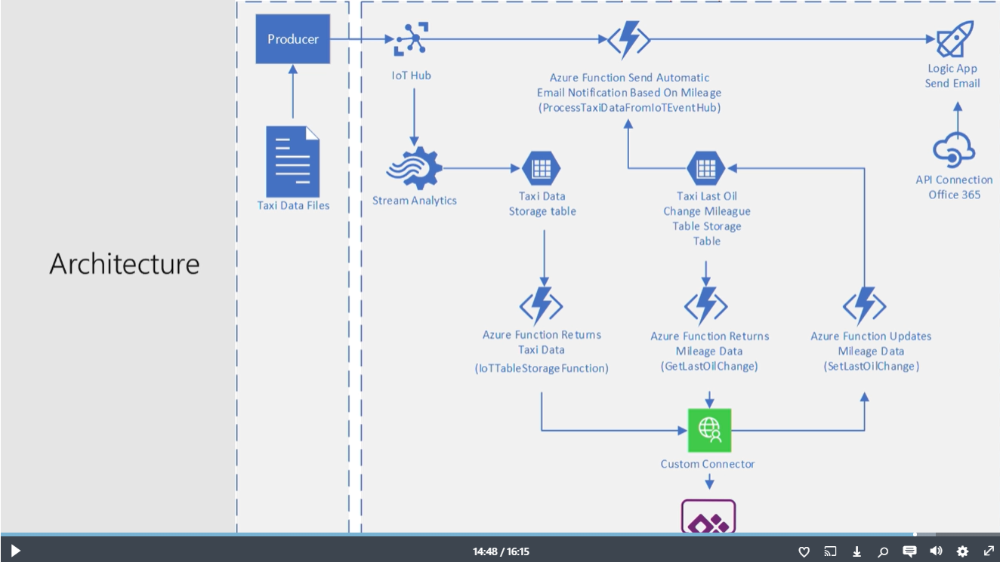
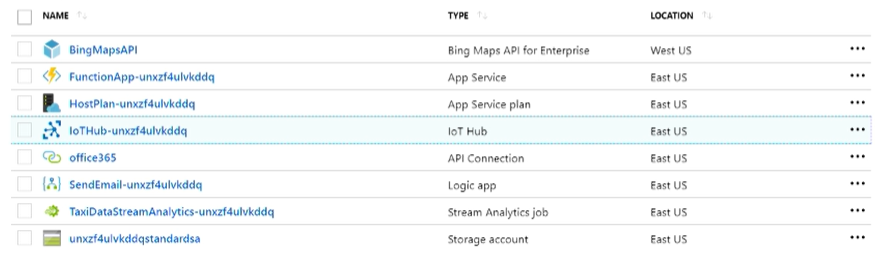

# FarmBeats_project
## Things to do
- How to send data from the AgroHack code that uses FarmBeats student kit hardware to the solution accelerator via the Event Hub (Event Hub can only receive messages, whereas IoT Hub can receive and send). Document this process setup and ideally develop a scenario for this.
- Connect FarmBeats to IoT central dashboard to see data (Similar to above). Use a function to do this.
- Connect the kits of pi to Azure FarmBeats.
	- Ingest Historical telemetry data in azure.
	- Queries telemetry.
- Data export from Azure FarmBeats.
- Develop app in PowerApps.

## Additional Info

A resource group is like a project where all the specific tools from azure are stored for that specific project.	

App service contains all the functions used to get the data from IoT Hub and update data in the Hub from the App. The custom connector is from PowerApps. It calls the Function app from Azure. 

