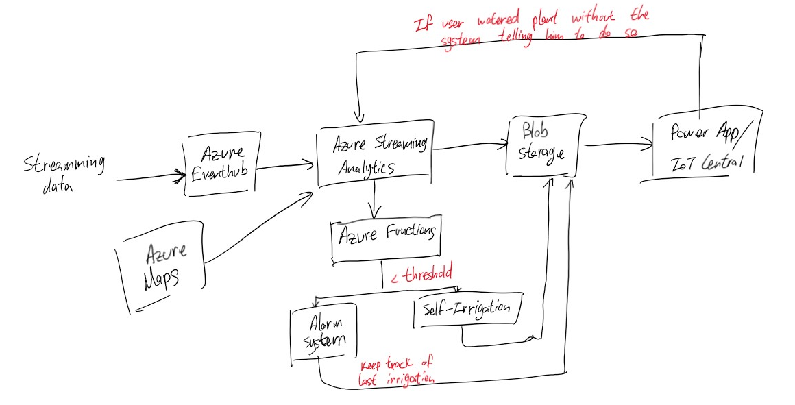

# **Scenario 2: Self-irrigation**

## **Description**

The main goal for this scenario is to learn how to implement an automated irrigation system.
The scenario it self is divided into three different parts:
- [Preparation.](#1-Preparation)

- [Set up an alarm system.](#2-set-up-an-alarm-system)

- [Automated irrigation.](#3-automated-irrigation)

- [Azure Maps for weather prediction.](#4-azure-maps-for-weather-prediction)

## **Breakdown of the scenario**
### **1. Preparation**

#### **Setting Hardware:**

Mainly two sensors are used in this scenario. They are the Grove temperature and humidity sensor (GHT11) and the Grove moisture sensor.

Let's set up the **GHT11 sensor** first.

- Plug the Grove Base Hat into Raspberry Pi.

- Connect the temperature and humidity sensor to Port 12 of the Base Hat.


Similar instrustrustions are applied to the **moisture sensor** as well.

- Connect the Grove - Moisture Sensor to the A0 port of the Base Hat.

- After plugging in all the sensors above, connect the Raspberry Pi to PC through USB cable.


#### **Setting Software:**

- Install the **Grove** module.

```
curl -sL https://github.com/Seeed-Studio/grove.py/raw/master/install.sh | sudo bash -s -
```

- Download the source file by cloning the grove.py library.

```
cd ~
git clone https://github.com/Seeed-Studio/Seeed_Python_DHT.git
```

- Excute below commands to run the code.

```
cd Seeed_Python_DHT
sudo python setup.py install
cd ~/Seeed_Python_DHT/examples
python dht_simpleread.py 
```

- Now try to detect the atmosphere temperature and moisture with the following **dht_simpleread.py** code.

```python
import time
import seeed_dht
def main():
 
    # for DHT11/DHT22
    sensor = seeed_dht.DHT("11", 12)
    # for DHT10
    # sensor = seeed_dht.DHT("10")
 
    while True:
        humi, temp = sensor.read()
        if not humi is None:
            print('DHT{0}, humidity {1:.1f}%, temperature {2:.1f}*'.format(sensor.dht_type, humi, temp))
        else:
            print('DHT{0}, humidity & temperature: {1}'.format(sensor.dht_type, temp))
        time.sleep(1)
 
 
if __name__ == '__main__':
    main()
```


### **2. Set up an alarm system**

#### **Objective**
Set up a system to alert the user when the plant needs to be watered. 

#### **Learning outcomes**
- Investigate creating rules using Azure IoT Central
  - Send email or push notification when the soil moisture is below a certain threshold.

  - Optional: check if temperature/pressure/light intensity is outside the optimal range.

  - Learn to use Azure Events Hub, Azure Stream Analytics and Azure Functions to process data.
  - Determine the date and time that the plant was last watered.

#### **Key areas to teach**
IoT Azure Services, Data, Microcontroller Programming, AI.


_Optionally a LED indicator can be integrated to indicate if the plant needs watering._


### **3. Automated irrigation**

#### Objective
To set up a simple automated irrigation system.

_**Additional equipment:** Relay module, water pump._

#### Learning Outcomes
- Practical application of previous knowledge that links to digital farming.

  - Option 1: 
    Setup the water pump with existing device
  
  - Option 2: Register a separate device to control the water pump.

### 4. Azure Maps for weather prediction

#### Objective
Use Azure Maps to determine whether irrgation is needed depending on weather conditions. 

#### Learning Outcomes
- Learn to interface with other Azure Services.

- Become confortable with more complex data processing.

### **Azure Services Integration**


<hr>

*Go to next scenario: [Predict the weather](./3.-Predict_the_weather.md)*
